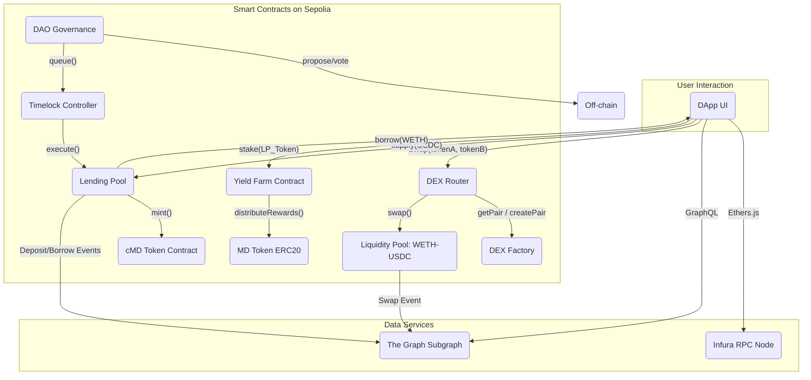

# 🏗️ [My DeFi] — 基于 Sepolia 的去中心化金融平台  
> **代币：MD | GitHub：[https://github.com/lookteas/my-defi](https://github.com/lookteas/my-defi)**

 *(建议替换为实际Logo)*

---

## 📌 项目概述

### 项目名称  
**[My DeFi]** —— 一个模块化、开源、社区驱动的去中心化金融（DeFi）协议原型

### 愿景  
构建一个安全、透明、用户友好的 DeFi 生态系统，提供 **代币兑换、借贷与流动性挖矿** 等核心服务。本项目率先部署于 **Ethereum Sepolia 测试网**，用于功能验证、智能合约审计与社区反馈收集，为未来主网迁移奠定坚实基础。

### 目标用户
- 加密交易者：寻求低滑点、无许可的代币交换；
- 流动性提供者（LPs）：通过质押资产赚取手续费收益；
- 收益农夫：参与挖矿获取治理代币奖励；
- DeFi 开发者与爱好者：学习、贡献、共建开源协议。

### 核心价值
> **“代码即法律，用户即主权”**  
> - 所有资金由用户钱包直接控制，无需托管；  
> - 交易逻辑完全链上执行，公开可验；  
> - 通过治理代币 **MD** 实现真正去中心化自治（DAO）；  
- 零中间成本，高效资本配置。

---


## 🎨 用户体验与设计规范 (UX/UI)

### ✅ 1.1 用户故事 (User Stories)

**场景 1: 代币兑换 (Token Swap)**
- **作为一名用户，** 我希望能连接我的钱包，在一个清晰的界面上选择我想卖出的代币A和想买入的代币B。
- **作为一名用户，** 当我输入卖出代币A的数量时，系统应能实时计算并显示我将收到的代币B的最小数量，以及本次交易的滑点。
- **作为一名高级用户，** 我希望能点击设置按钮，手动调整滑点容忍度（如 0.5%, 1%, 3%）和交易截止时间。
- **作为一名用户，** 如果我的代币A余额不足或未授权，兑换按钮应为灰色不可点击状态，并有明确的提示信息。

**场景 2: 存款借贷 (Lending)**
- **作为一名用户，** 我希望在“存款”页面看到支持的资产列表及其当前的存款APY。
- **作为一名用户，** 我可以输入存款数量，一键完成存款操作，并能在我的仪表盘中看到我获得的cMD凭证代币。
- **作为一名用户，** 当我存入资产后，我希望在“借款”页面看到我的总抵押价值和我可借款的额度。
- **作为一名用户，** 我希望监控我的健康因子（Health Factor），当它低于某个阈值（如 1.2）时，界面能用醒目的颜色（黄色或红色）向我发出清算风险预警。

### ✅ 1.2 UI/UX 设计流程

所有功能的开发都必须遵循“设计先行”的原则，以确保用户体验的一致性和高质量。
- **设计稿与原型:** [**Figma 设计稿链接 (点击此处)**](https://www.figma.com/file/your-project-link) *(请替换为实际链接)*
- **流程:**
  1.  **线框图 (Wireframes):** 产品经理与设计师合作，绘制核心页面的低保真线框图，确定信息架构和交互流程。
  2.  **高保真设计稿 (Mockups):** 设计师根据线框图，完成包含所有视觉元素（颜色、字体、间距）的高保真UI设计。
  3.  **组件库 (Component Library):** 设计师在Figma中建立可复用的UI组件库（如按钮、输入框、卡片等）。
  4.  **可点击原型 (Prototype):** 将设计稿链接成可交互的原型，供团队在开发前进行评审和可用性测试。

---


## 🔧 核心功能模块

### ✅ 2.1 基础功能

#### **钱包连接（Wallet Integration）**
- 支持 MetaMask、Coinbase Wallet、WalletConnect 等主流浏览器钱包；
- 自动识别 Sepolia 网络，无缝切换账户；
- 展示余额：Sepolia ETH、MD、cMD、LP 代币等。

#### **用户仪表盘（Dashboard）**
- 实时资产总览：总资产、持仓分布、净值曲线；
- 协议头寸：存款、借款、质押状态；
- 收益统计：利息收入、挖矿奖励、手续费分成；
- 交易历史：带哈希链接的可追溯记录；
- 推送通知：利率变化、清算预警、奖励发放。

---

### ✅ 2.2 DeFi 核心业务

#### **去中心化交易所（DEX）**
##### 🔁 代币兑换（Token Swap）
- 支持任意 ERC-20 代币对（如 WETH/USDC, DAI/MD）；
- 使用恒定乘积公式（x * y = k）计算价格；
- 显示预估成交价、最小接收量、滑点容忍度（默认 0.5%）；
- 支持多跳路由（如 WETH → USDC → MD）。

##### 💧 流动性池（Liquidity Pools）
- 用户注入等值资产（如 100 USDC + 0.1 WETH）创建 LP；
- 获得 `WETH-USDC-LP` 代币，代表池中份额；
- 按比例分得交易手续费（0.3%）；
- 支持随时提取流动性，自动结算累计收益。

#### **借贷协议（Lending & Borrowing）**
##### 📦 存款（Supply）
- 存入资产（如 USDC） → 获得 `cMD`（计息凭证）；
- APY 动态调整，基于市场供需；
- 实时查看累计利息与可提现金额。

##### 💳 借款（Borrow）
- 使用已存资产作为抵押品（如 WETH），借出其他资产（如 USDC）；
- 最大贷款价值比（LTV）：75%；
- 清算机制：当抵押率 ≤ 110% 时，允许任何人触发清算，奖励清算人 5% 抵押品；
- 借款需支付稳定利息，逾期将被强制平仓。

#### **流动性挖矿 / 收益农场（Yield Farming）**
- 质押 LP 代币或原生代币 **MD** 参与挖矿；
- 奖励为 **MD 代币**（ERC-20）；
- 激励策略：
  - 初始流动性激励（ILS）：前 14 天双倍奖励；
  - 长期锁仓加权（每增加 30 天，+10% 奖励系数）；
  - 多池复合收益（预留扩展接口）；
- 可视化 APY 预测工具，辅助决策。

---

### ✅ 2.3 去中心化治理（DAO）

#### **治理代币：MD**
- 总供应量：**10,000,000 MD**
- 分配方案：
  - 60% → 流动性挖矿奖励（四年线性释放）
  - 20% → 团队与生态发展（四年线性解锁）
  - 15% → 社区空投与早期贡献者
  - 5% → 审计与基金会储备
- 无预挖、无私募，公平启动。

#### **提案与投票系统**
- 任何持有 ≥ **1,000 MD** 的地址可提交提案；
- 提案类型：
  - 修改 LTV、利率模型、手续费率；
  - 新增支持资产或流动性池；
  - 更新合约逻辑（需经时间锁延迟执行）；
- 投票规则：
  - 周期：7 天；
  - 成功门槛：赞成票 ≥ 40%，总票数 ≥ 100,000 MD；
- 投票机制：使用 **Snapshot.org** 进行链下签名投票，结果通过链上合约执行（增强抗女巫攻击）；
- 所有提案与投票记录永久存储于 IPFS + 链上哈希，确保透明可查。

---

## 🏗️ 系统架构

采用**三层 DApp 架构**，保障安全性、可扩展性与去中心化：

| 层级           | 组件                           | 说明                                                         |
| -------------- | ------------------------------ | ------------------------------------------------------------ |
| **前端层**     | React.js + Next.js + Chakra UI | 用户交互界面，无状态存储，纯前端渲染                         |
| **区块链层**   | Solidity 智能合约（Sepolia）   | 所有核心逻辑（Swap、Lending、Farm、Governance）均由链上合约执行，不可篡改 |
| **数据服务层** | The Graph + Infura + IPFS      | 索引事件、提供 GraphQL API；前端静态资源托管于 IPFS          |

> 🔐 **安全原则**：  
> - 合约无管理员后门（使用 `TimelockController` 控制升级）  
> - 关键函数均使用 `ReentrancyGuard`、`AccessControl`  
> - 所有外部调用采用 Checks-Effects-Interactions 模式  

---


###  合约架构图（Contract Architecture Diagram）




## 🔬 智能合约详细规范 (Smart Contract Specifications)

### ✅ `MyDeFiToken.sol` (ERC20)
- **继承:** `@openzeppelin/contracts/token/ERC20/ERC20.sol`, `@openzeppelin/contracts/access/Ownable.sol`
- **状态变量:**
  - `string public constant NAME = "My DeFi Token";`
  - `string public constant SYMBOL = "MD";`
  - `uint8 public constant DECIMALS = 18;`
  - `uint256 public constant TOTAL_SUPPLY = 10_000_000 * 10**18;`
- **核心函数:**
  ```solidity
  /**
   * @notice 仅有合约Owner（部署者或YieldFarm合约）可以铸造新币。
   * @param to 接收代币的地址。
   * @param amount 铸造的数量。
   */
  function mint(address to, uint256 amount) external onlyOwner;
  ```

### ✅  `LendingPool.sol`
- **状态变量:**
  - `mapping(address => uint256) public assetTotalSupply;` // 各资产总存款
  - `mapping(address => mapping(address => uint256)) public userDeposits;` // 用户各资产存款
  - `address public oracle;` // 价格预言机地址
  - `uint256 public constant LIQUIDATION_THRESHOLD = 110;` // 110% 清算阈值
- **核心函数:**
  ```solidity
  event Deposit(address indexed user, address indexed asset, uint256 amount);
  event Borrow(address indexed user, address indexed asset, uint256 amount);
  
  /**
   * @notice 用户存款，并获得计息凭证。
   * @param _asset 地址。
   * @param _amount 数量。
   */
  function supply(address _asset, uint256 _amount) external;
  
  /**
   * @notice 在足额抵押的前提下借出资产。
   * @dev 函数内部必须检查用户的健康因子（Health Factor）。
   * @param _asset 借出的资产地址。
   * @param _amount 借出的数量。
   */
  function borrow(address _asset, uint256 _amount) external;
  ```

### ✅ The Graph Schema (`schema.graphql`)
```graphql
type Swap @entity {
  id: ID!
  transactionHash: Bytes!
  timestamp: BigInt!
  user: Bytes! # address of swapper
  tokenIn: Bytes!
  tokenOut: Bytes!
  amountIn: BigDecimal!
  amountOut: BigDecimal!
}

type Deposit @entity {
  id: ID!
  transactionHash: Bytes!
  timestamp: BigInt!
  user: Bytes!
  asset: Bytes!
  amount: BigDecimal!
}
```


## 🛠️ 技术栈

### **区块链网络**
- **Ethereum Sepolia Testnet**：PoS，免费 Gas，广泛兼容工具链

### **智能合约开发**
| 工具                             | 用途                                                         |
| -------------------------------- | ------------------------------------------------------------ |
| **Solidity v0.8.20+**            | 主语言，启用安全特性（如溢出检查）                           |
| **Hardhat**                      | 编译、部署、测试、脚本自动化                                 |
| **OpenZeppelin Contracts v4.9+** | 使用标准组件：<br>• `ERC20`<br>• `ERC721`<br>• `AccessControl`<br>• `ReentrancyGuard`<br>• `TimelockController`<br>• `Initializable` |
| **Local Network**                | Hardhat 内置节点用于快速单元测试                             |
| **Slither / Solhint**            | 静态代码分析与安全扫描，集成至CI/CD流程                      |

### **前端开发**
| 技术                   | 说明                             |
| ---------------------- | -------------------------------- |
| **React.js / Next.js** | SSR 支持，SEO 友好，性能优化     |
| **Ethers.js v6**       | 与以太坊交互的核心库             |
| **Web3Modal**          | 支持 20+ 钱包一键接入            |
| **Chakra UI**          | 响应式、无障碍、主题化 UI 组件库 |
| **Zustand**            | 轻量状态管理                     |
| **IPFS (Pinata)**      | 静态资源去中心化部署             |

### **基础设施与中间件**
| 服务                   | 作用                                                       |
| ---------------------- | ---------------------------------------------------------- |
| **Alchemy / Infura**   | Sepolia RPC 节点服务                                       |
| **The Graph Protocol** | 索引关键事件（Deposit, Withdraw, Swap, Vote）→ GraphQL API |
| **Snapshot.org**       | 链下治理投票（避免高 Gas 成本）                            |
| **GitHub Actions**     | CI/CD：PR 合并自动部署至 Sepolia                           |
| **Tenderly**           | 合约监控、模拟交易、异常报警                               |

### **安全与审计**
- 所有合约通过 **Hardhat + Waffle** 单元测试（覆盖率 ≥ 90%）；
- 计划在主网前完成第三方审计（CertiK / Hacken）；
- 使用 **Chainlink Price Feeds（未来）** 替代链下喂价；
- 关键操作引入**时间锁（Timelock）**，防止恶意升级。

---


## 🔐 安全与风险管理

### ✅  威胁建模 (Threat Modeling)

| 功能模块       | 潜在威胁                                                     | 缓解措施                                                     |
| :------------- | :----------------------------------------------------------- | :----------------------------------------------------------- |
| **DEX (Swap)** | **闪电贷攻击：** 攻击者通过闪电贷操纵流动性池中某个代币的价格。 | **价格预言机使用TWAP** (时间加权平均价格) 而不是即时价格，以抵抗瞬时价格操纵。 |
| **Lending**    | **价格预言机失灵：** 预言机被攻击或提供错误价格，导致坏账或错误清算。 | **使用Chainlink等多来源、去中心化的预言机**。在合约中设置价格波动断路器，当价格在短时间内偏离过大时暂停借贷。 |
| **Lending**    | **重入攻击 (Re-entrancy):** 在`supply`或`borrow`函数中，恶意合约在状态更新前回调本合约。 | **严格遵循“检查-生效-交互”模式**。所有关键函数使用OpenZeppelin的`ReentrancyGuard`修饰器。 |
| **Governance** | **恶意提案：** 巨鲸通过恶意提案（如将国库资金转给自己）并投票通过。 | **引入时间锁（Timelock）**。所有治理通过的提案必须在时间锁中排队等待一段固定的时间（如48小时）后才能执行，给予社区充分的时间来审查和反应。 |

### ✅ 紧急预案 (Emergency Protocols)
- **暂停机制:** 所有核心合约（LendingPool, YieldFarm）将继承OpenZeppelin的`Pausable`合约。
- **暂停权限:** 暂停/恢复功能由一个 **3/5 的社区多签钱包**控制，而非单一地址。初始成员由核心贡献者担任，未来通过治理选举。
- **响应流程:**
  1.  **发现漏洞：** 白帽或团队成员发现严重漏洞。
  2.  **执行暂停：** 多签钱包立即执行`pause()`函数，暂停所有资金流动相关操作（存款、取款、借款、质押）。
  3.  **社区通告：** 立即通过官方Twitter、Discord发布安全警报，解释暂停原因。
  4.  **修复与重启：** 部署修复后的合约，通过治理投票将旧合约的控制权迁移至新合约，然后恢复系统运行。

---

## 🗺️ 项目路线图

| 阶段        | 时间      | 目标                                                     |
| ----------- | --------- | -------------------------------------------------------- |
| **Phase 1** | Week 1–4  | 完成 DEX（Swap + LP） + 用户仪表盘，部署至 Sepolia       |
| **Phase 2** | Week 5–8  | 上线借贷协议（Supply/Borrow）+ 清算机制 + MD 代币发行    |
| **Phase 3** | Week 9–12 | 启动流动性挖矿农场 + DAO 治理系统（Snapshot + 链上执行） |
| **Phase 4** | Month 4   | 开源全部代码、撰写白皮书、邀请社区参与测试与审计         |
| **Phase 5** | Month 5+  | 准备 Mainnet 迁移，启动空投计划，建立社区激励基金        |

---

## 📂 项目结构（仅供参考）

```bash
my-defi/
├── contracts/                 # Solidity 智能合约
│   ├── MyDeFiToken.sol        # MD 代币（ERC-20）
│   ├── LiquidityPool.sol      # DEX 流动性池
│   ├── LendingPool.sol        # 借贷协议
│   ├── YieldFarm.sol          # 收益农场
│   ├── Governance.sol         # 治理合约（含 Timelock）
│   └── interfaces/            # 接口定义
├── scripts/                   # 部署与交互脚本
│   ├── deploy.js
│   └── mint-md.js
├── test/                      # 单元测试（Waffle + Hardhat）
│   ├── liquidity-pool.test.ts
│   └── governance.test.ts
├── frontend/
│   ├── public/                     # 👉 静态资源根目录（直接映射到 /）
│   │   ├── images/                 # 所有图片、图标、背景图
│   │   │   ├── logo.png
│   │   │   ├── favicon.ico
│   │   │   ├── banner.jpg
│   │   │   └── icons/
│   │   │       ├── md-icon.svg
│   │   │       └── wallet-connect.svg
│   │   │
│   │   ├── styles/                 # 全局 CSS / SCSS 文件（非模块化）
│   │   │   └── globals.css         # 主样式表（导入字体、重置、全局变量）
│   │   │
│   │   └── fonts/                  # 自定义字体文件（.woff2, .ttf）
│   │       └── Inter-Variable.woff2
│   │
│   ├── src/
│   │   ├── app/                    # Next.js App Router 根目录
│   │   │   ├── layout.tsx
│   │   │   ├── page.tsx
│   │   │   └── ...
│   │   │
│   │   ├── components/             # 可复用组件
│   │   │   ├── Header/
│   │   │   │   ├── Header.tsx
│   │   │   │   └── Header.module.css  # 👉 组件级 CSS Modules
│   │   │   ├── WalletButton/
│   │   │   │   ├── WalletButton.tsx
│   │   │   │   └── WalletButton.module.css
│   │   │   └── ...
│   │   │
│   │   ├── lib/                    # 工具函数、Web3、GraphQL 客户端
│   │   ├── hooks/                  # 自定义 React Hooks
│   │   ├── contexts/               # 状态上下文（如钱包、用户数据）
│   │   └── styles/                 # 可选：全局 SCSS 变量或主题配置（非必须）
│   │       └── theme.ts            # Chakra UI 主题配置（推荐）
│   │
│   ├── styles/                     # 👉 旧版 Pages Router 用（如仍用）
│   │   └── global.css              # （若迁移到 App Router，此目录可移除）
│   │
│   ├── next.config.js
│   ├── package.json
│   └── tailwind.config.js          # 如果使用 Tailwind CSS（推荐）
│
├── graphs/                    # The Graph 子图定义
│   └── schema.graphql
├── hardhat.config.js
├── package.json
├── README.md                  # ← 本文档
└── .github/workflows/deploy.yml # CI/CD 自动部署流水线
```

>  所有合约通过 OpenZeppelin Defender 和 Hardhat 安全检查。

---

## 验收标准（Definition of Done）

一个功能模块完成的标准是：

|                                                  |      |
| ------------------------------------------------ | ---- |
| ✅ 智能合约已编写并通过 Hardhat 编译              | ☑️    |
| ✅ 所有函数均有单元测试，覆盖率 ≥95%              | ☑️    |
| ✅ 通过`slither`和`solhint`安全扫描（无高危告警） | ☑️    |
| ✅ 前端可连接钱包并调用合约交互                   | ☑️    |
| ✅ 前端从 The Graph 正确读取历史数据              | ☑️    |
| ✅ 所有交互操作均可在 Etherscan 上验证            | ☑️    |
| ✅ 文档已更新（README / docs/）                   | ☑️    |
| ✅ CI 流水线通过                                  | ☑️    |

> **只有当以上全部满足，该功能才算“完成”。** 


## 🌐 部署与访问

- **Sepolia 部署地址**（以下仅为示例，项目中要以真实地址填写）：
  - MD Token: `0x...`
  - DEX Factory: `0x...`
  - Lending Pool: `0x...`
  - Governance: `0x...`

> 🔗 查看最新合约地址：[https://github.com/lookteas/my-defi#deployment-addresses](https://github.com/lookteas/my-defi#deployment-addresses)

- **前端应用**（IPFS 去中心化部署）：
  
  > 👉 [https://mydefi.ipfs.nftstorage.link](https://mydefi.ipfs.nftstorage.link)  
  > （*实时同步自 GitHub 主分支，每次 commit 自动更新*）
  
- **治理投票平台**：
  > 👉 [https://snapshot.org/#/mydefi.eth](https://snapshot.org/#/mydefi.eth)

---

## 📜 代币信息（MD Token）

| 属性     | 值                                                           |
| -------- | ------------------------------------------------------------ |
| 名称     | My DeFi Token                                                |
| 符号     | MD                                                           |
| 小数位   | 18                                                           |
| 总供应量 | 10,000,000 MD                                                |
| 合约地址 | [查看最新地址](https://github.com/lookteas/my-defi#deployment-addresses) |
| 标准     | ERC-20                                                       |
| 发行方式 | 公平启动，无预挖                                             |

> 通过 OpenZeppelin `ERC20` 标准实现，支持 `approve`, `transferFrom`, `mint`, `burn`。

---

## 🤝 如何参与？

1. **使用产品**：连接钱包，在 Sepolia 上体验 DEX、借贷与挖矿。
2. **参与治理**：持有 ≥1,000 MD，发起或投票提案。
3. **报告问题**：提交 Issue 至 [GitHub Issues](https://github.com/lookteas/my-defi/issues)
4. **贡献代码**：Fork 项目，提交 PR，我们欢迎所有开发者参与！


---

## 📎 附录：术语表

| 术语         | 解释                                                    |
| ------------ | ------------------------------------------------------- |
| **LP Token** | 流动性提供者凭证，代表你在资金池中的份额                |
| **LTV**      | Loan-to-Value Ratio，贷款价值比，决定最大可借额度       |
| **APY**      | Annual Percentage Yield，年化收益率，含复利             |
| **DAO**      | Decentralized Autonomous Organization，去中心化自治组织 |
| **cMD**      | 计息凭证代币，代表你存入的 MD 及其产生的利息            |
| **Timelock** | 合约升级延迟机制，防止恶意操控                          |


---


