# DEX交易流程图

## 1. 技术架构图

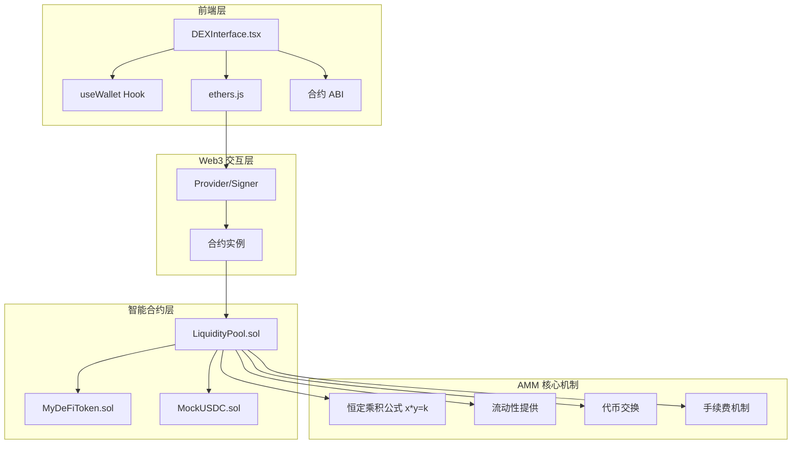

## 2. 核心组件架构

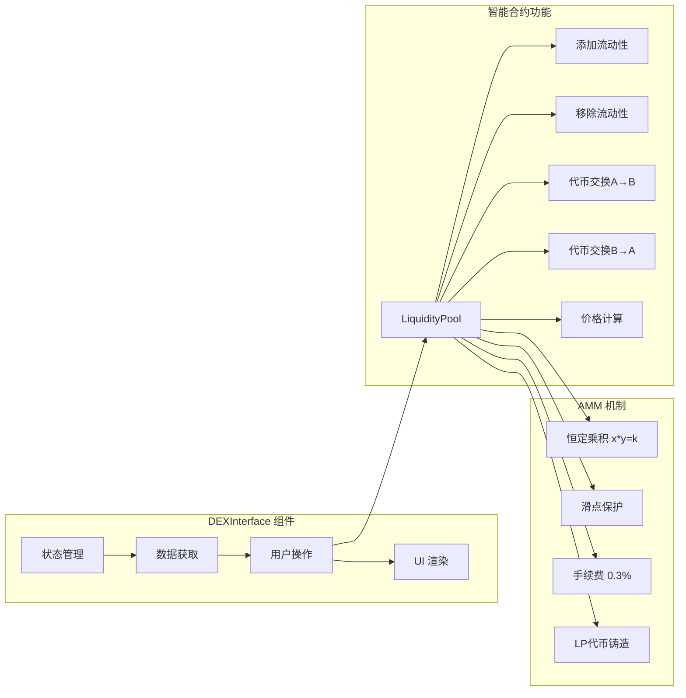

## 3. DEX交易详细流程

### 3.1 初始化流程

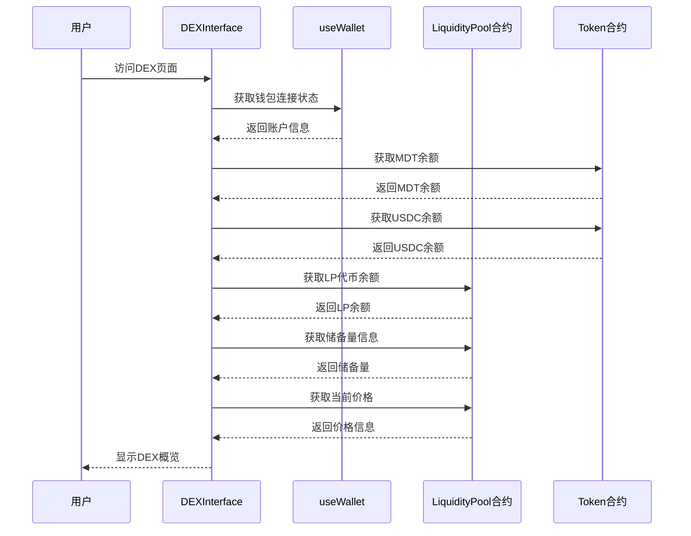

### 3.2 添加流动性流程

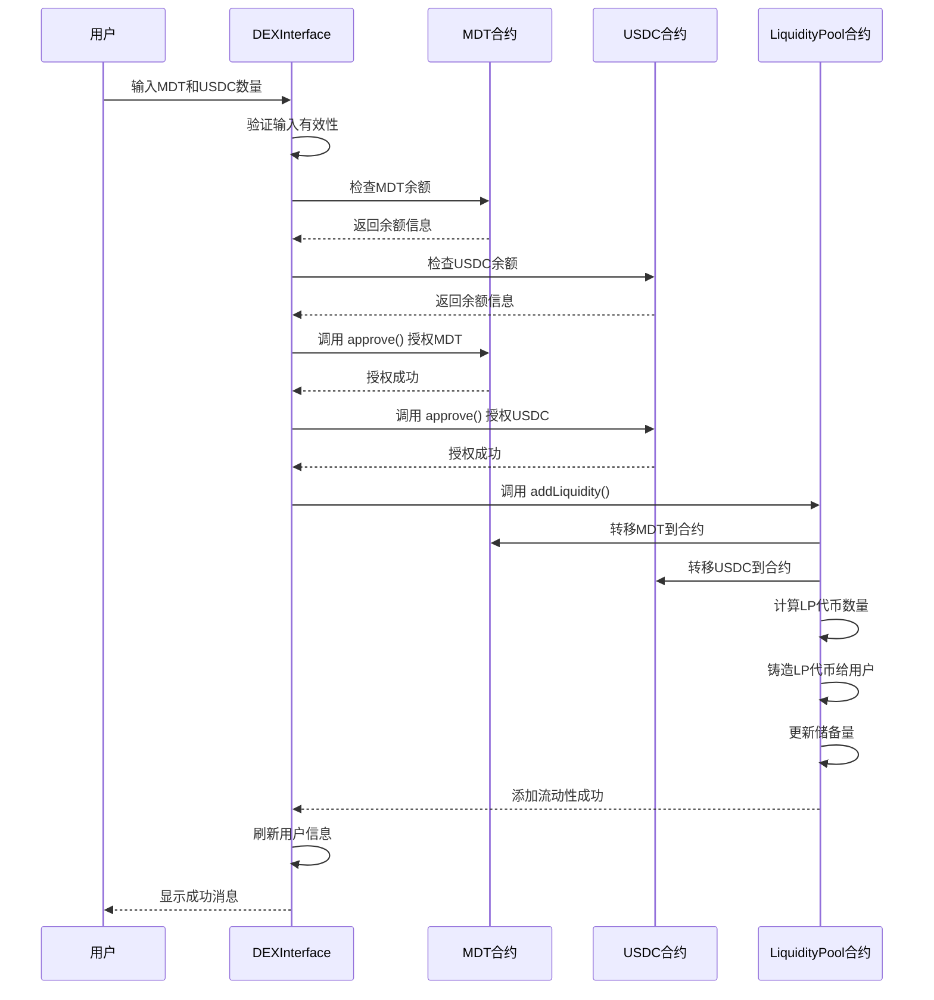

### 3.3 代币交换流程 (MDT → USDC)

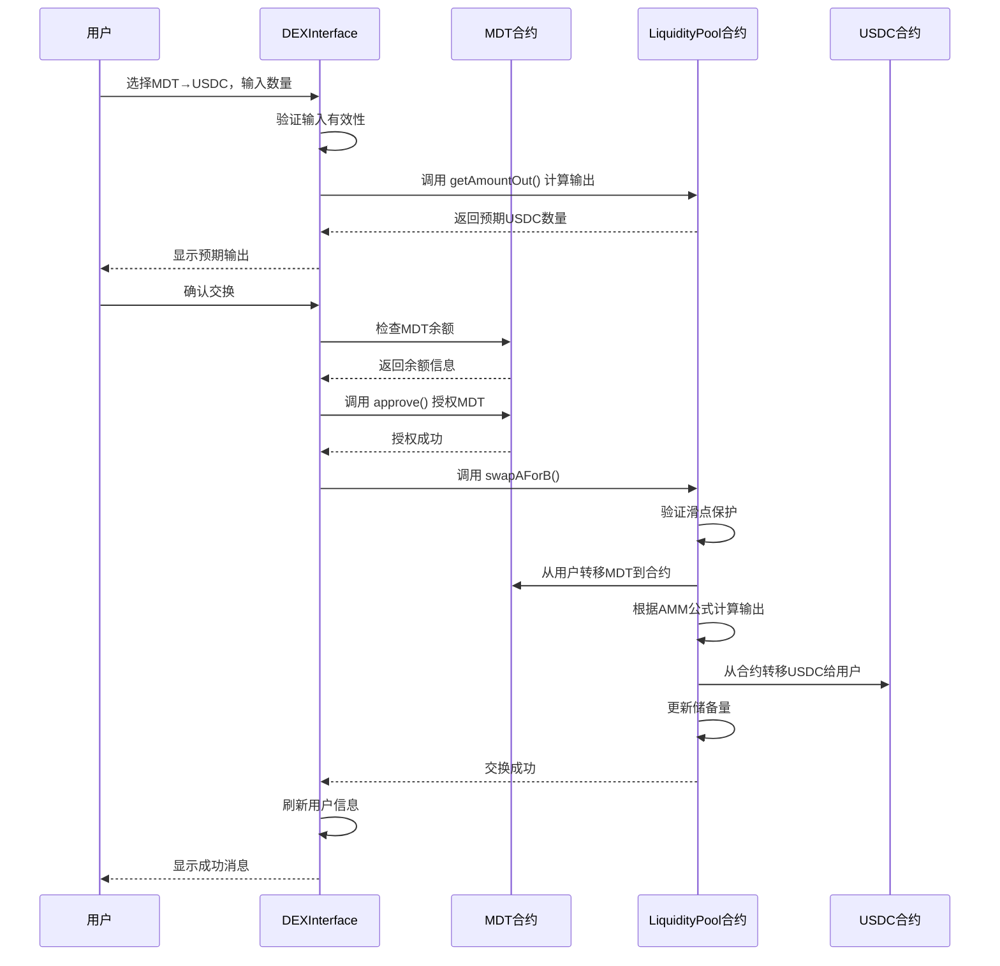

### 3.4 移除流动性流程

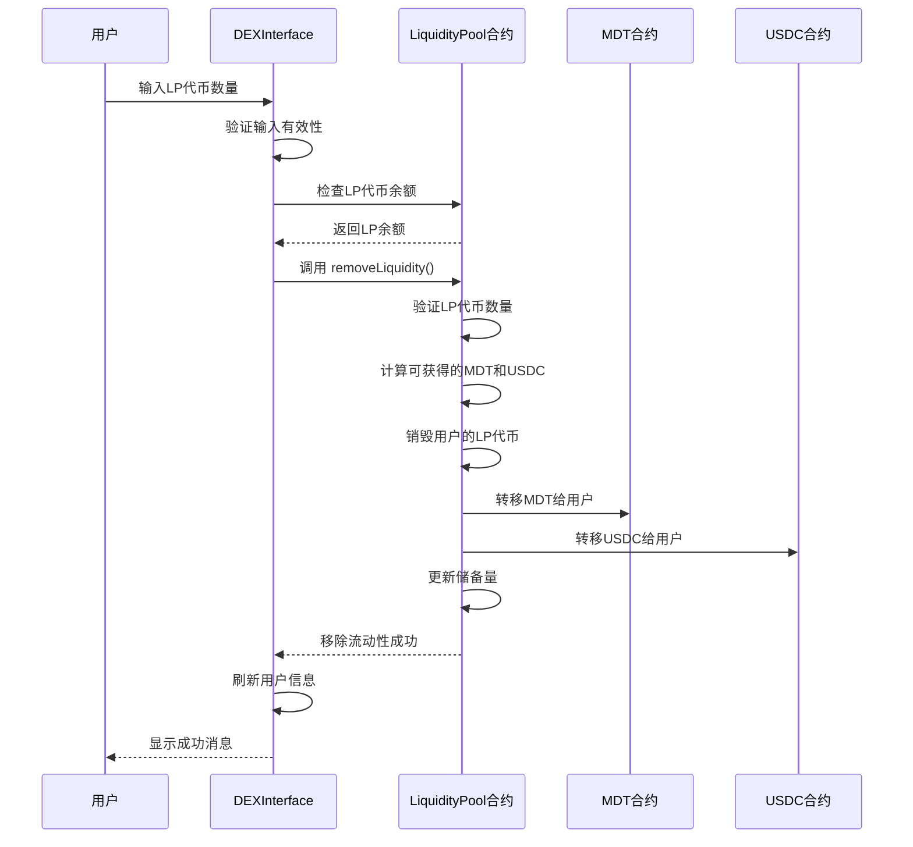

## 4. AMM 核心算法

### 4.1 恒定乘积公式

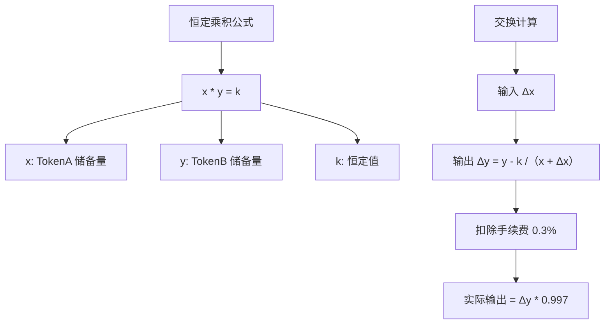

### 4.2 价格计算机制

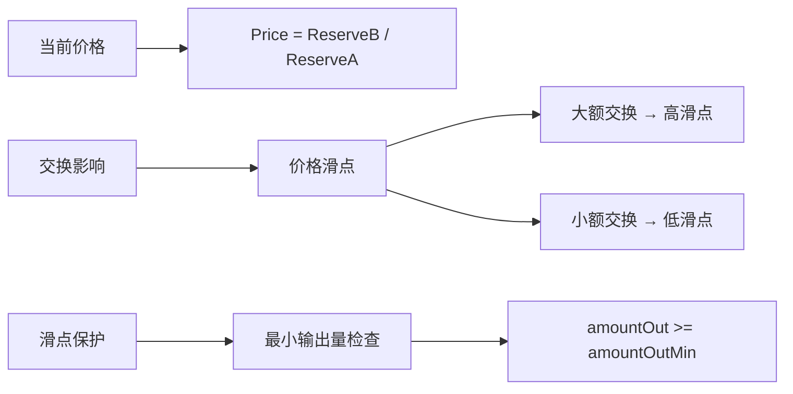

## 5. 核心代码结构

### 5.1 智能合约结构

```solidity
// LiquidityPool.sol 核心结构
contract LiquidityPool is ERC20, ReentrancyGuard, Ownable {
    // 状态变量
    IERC20 public immutable tokenA;
    IERC20 public immutable tokenB;
    uint256 public reserveA;
    uint256 public reserveB;
    uint256 public constant FEE_RATE = 3; // 0.3%
    
    // 核心功能
    function addLiquidity(uint256 amountADesired, uint256 amountBDesired) external;
    function removeLiquidity(uint256 liquidity, uint256 amountAMin, uint256 amountBMin) external;
    function swapAForB(uint256 amountAIn, uint256 amountBOutMin) external;
    function swapBForA(uint256 amountBIn, uint256 amountAOutMin) external;
    
    // 辅助功能
    function getAmountOut(uint256 amountIn, uint256 reserveIn, uint256 reserveOut) public pure;
    function getReserves() external view returns (uint256, uint256);
}
```

### 5.2 前端组件结构

```typescript
// DEXInterface.tsx 核心结构
interface DEXInterface {
  // 状态管理
  tokenBalance: string;
  usdcBalance: string;
  lpBalance: string;
  reserves: { token: string; usdc: string };
  price: string;
  
  // 核心功能
  fetchDEXInfo(): Promise<void>;
  handleAddLiquidity(): Promise<void>;
  handleRemoveLiquidity(): Promise<void>;
  handleSwap(): Promise<void>;
  calculateExpectedOutput(): Promise<void>;
  
  // UI 渲染
  renderOverview(): JSX.Element;
  renderActions(): JSX.Element;
}
```

## 6. 状态管理机制

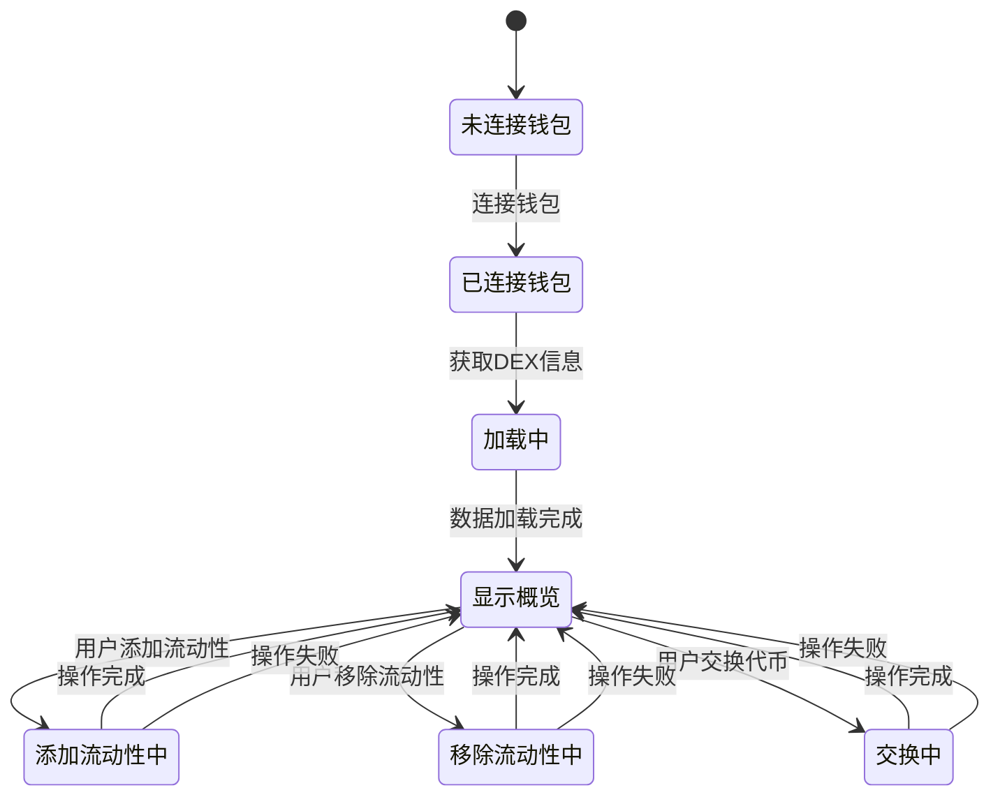

## 7. 手续费机制

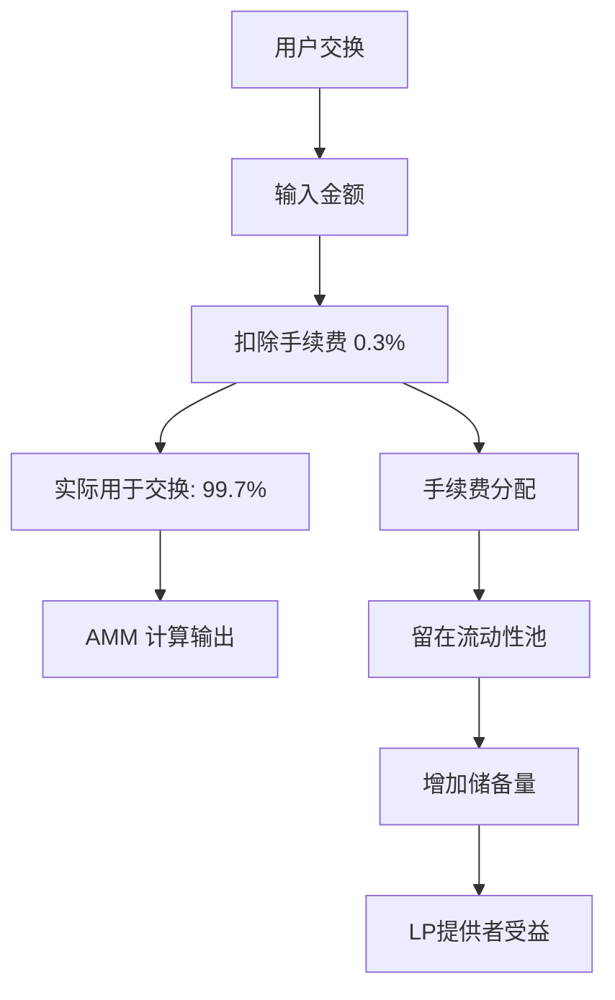

## 8. 错误处理机制

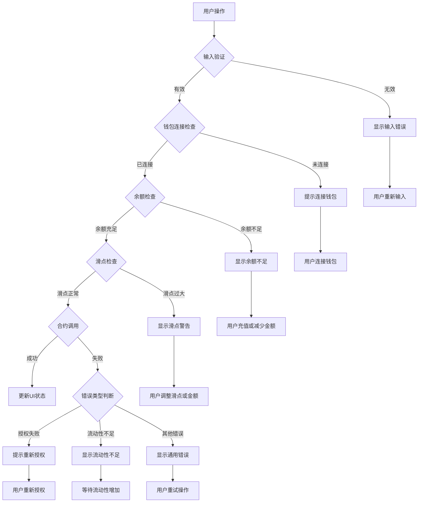

## 9. 安全机制

### 9.1 智能合约安全

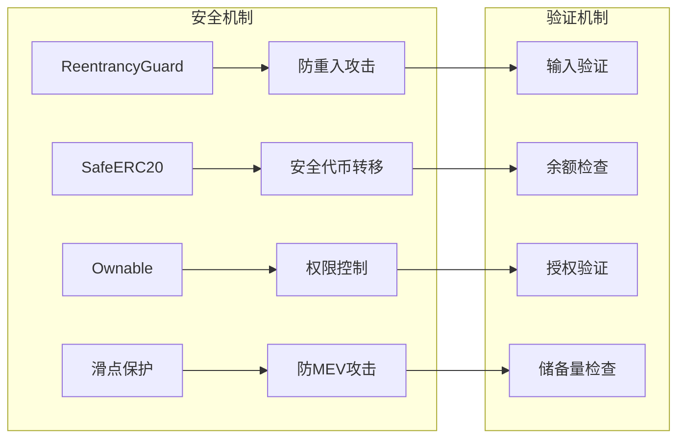

### 9.2 前端安全

```typescript
// 安全检查示例
const safeSwap = async (amount: string, fromToken: string) => {
  try {
    // 1. 输入验证
    const numericAmount = parseFloat(amount);
    if (isNaN(numericAmount) || numericAmount <= 0) {
      throw new Error('无效的输入金额');
    }
    
    // 2. 钱包连接检查
    if (!account || !signer) {
      throw new Error('钱包未连接');
    }
    
    // 3. 余额检查
    const balance = await getTokenBalance(fromToken);
    if (parseFloat(balance) < numericAmount) {
      throw new Error('余额不足');
    }
    
    // 4. 滑点保护
    const expectedOutput = await calculateExpectedOutput(amount, fromToken);
    const minOutput = expectedOutput * 0.99; // 1% 滑点保护
    
    // 5. 执行交换
    await executeSwap(amount, fromToken, minOutput);
  } catch (error) {
    handleError(error);
  }
};
```

## 10. 用户体验优化

### 10.1 实时数据更新

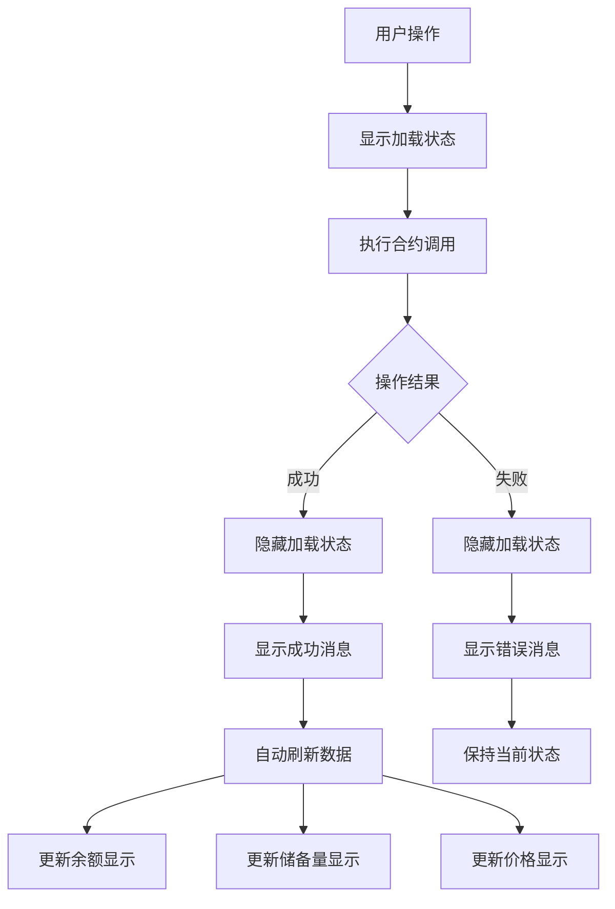

### 10.2 预期输出计算

```typescript
// 实时计算预期输出
const calculateExpectedOutput = async () => {
  if (!swapAmount || !provider) return;
  
  try {
    const liquidityContract = new Contract(
      CONTRACTS.LiquidityPool,
      LIQUIDITY_POOL_ABI,
      provider
    );
    
    const amount = parseEther(swapAmount);
    const [reserveA, reserveB] = await liquidityContract.getReserves();
    
    let output;
    if (swapFromToken === 'token') {
      output = await liquidityContract.getAmountOut(amount, reserveA, reserveB);
    } else {
      output = await liquidityContract.getAmountOut(amount, reserveB, reserveA);
    }
    
    setExpectedOutput(formatEther(output));
  } catch (error) {
    console.error('计算预期输出失败:', error);
    setExpectedOutput('0');
  }
};
```

## 11. 扩展性设计

### 11.1 多交易对支持

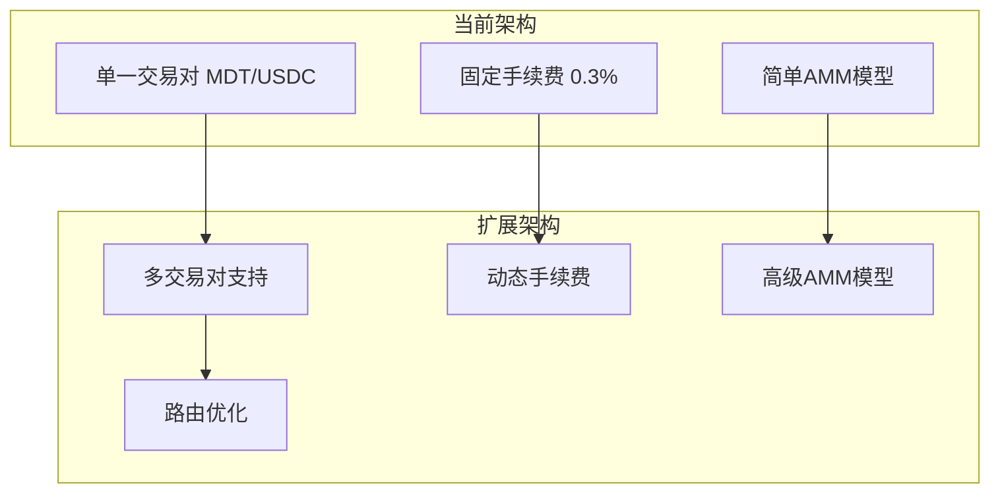

### 11.2 功能扩展点

```typescript
// 扩展接口设计
interface ExtendedDEX {
  // 多交易对支持
  supportedPairs: TradingPair[];
  
  // 路由功能
  findBestRoute(tokenIn: string, tokenOut: string, amountIn: string): Route;
  
  // 聚合流动性
  aggregateLiquidity(pairs: TradingPair[]): LiquidityInfo;
  
  // 高级订单类型
  limitOrder(params: LimitOrderParams): Promise<void>;
  stopLoss(params: StopLossParams): Promise<void>;
}
```

## 12. 性能优化

### 12.1 数据缓存

```typescript
// 缓存机制
const useDataCache = () => {
  const [cache, setCache] = useState<Map<string, any>>(new Map());
  
  const getCachedData = (key: string, fetcher: () => Promise<any>) => {
    if (cache.has(key)) {
      return cache.get(key);
    }
    
    return fetcher().then(data => {
      setCache(prev => new Map(prev).set(key, data));
      return data;
    });
  };
  
  return { getCachedData };
};
```

### 12.2 批量操作

```typescript
// 批量数据获取
const fetchAllDEXData = async () => {
  const [tokenBal, usdcBal, lpBal, reserves, price] = await Promise.all([
    tokenContract.balanceOf(account),
    usdcContract.balanceOf(account),
    liquidityContract.balanceOf(account),
    liquidityContract.getReserves(),
    liquidityContract.getPrice()
  ]);
  
  return { tokenBal, usdcBal, lpBal, reserves, price };
};
```

---

## 总结

DEX交易功能通过以下核心组件实现：

1. **智能合约层**：LiquidityPool.sol 实现AMM机制
2. **前端组件**：DEXInterface.tsx 提供用户交互界面
3. **AMM算法**：基于恒定乘积公式 x*y=k
4. **安全机制**：重入保护、滑点保护、权限控制
5. **用户体验**：实时数据更新、预期输出计算

该系统支持添加/移除流动性、代币交换等完整的DEX功能，具有良好的安全性和用户体验。