# 代币管理流程图

## 1. 技术架构图

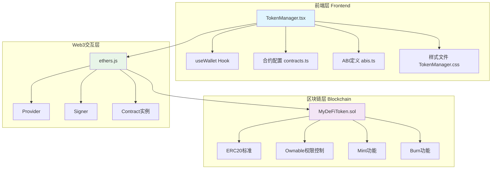

## 2. 核心组件架构

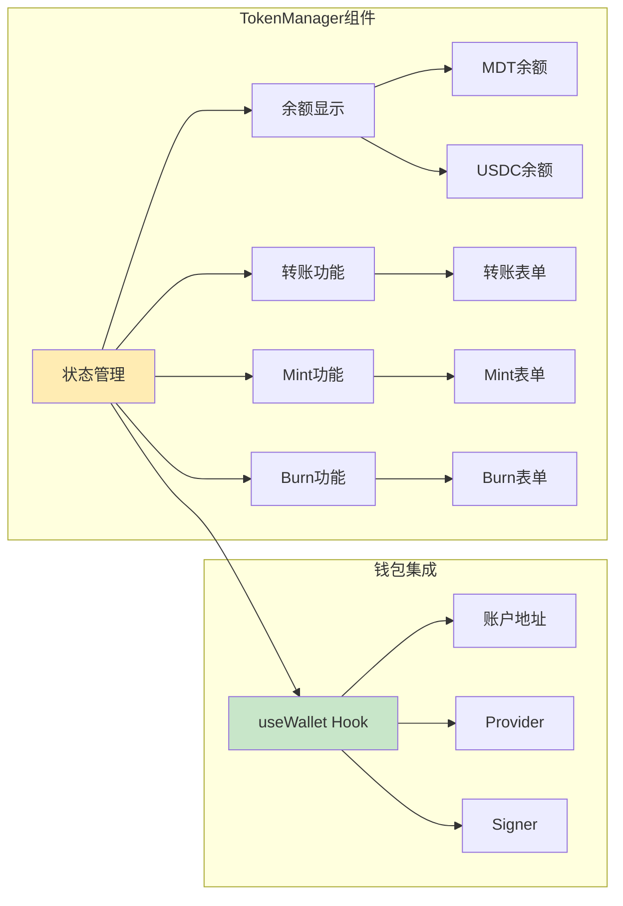

## 3. 代币管理详细流程

### 3.1 初始化流程

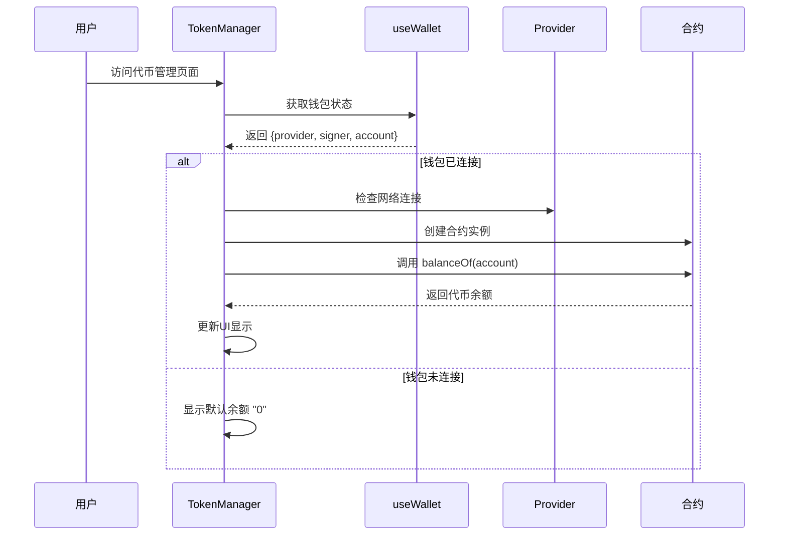

### 3.2 余额查询流程

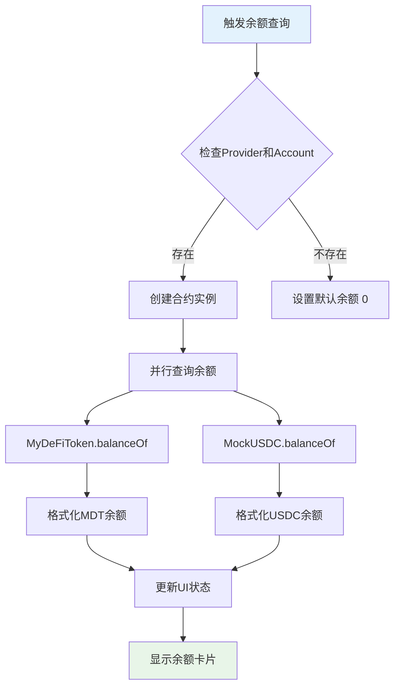

### 3.3 转账流程

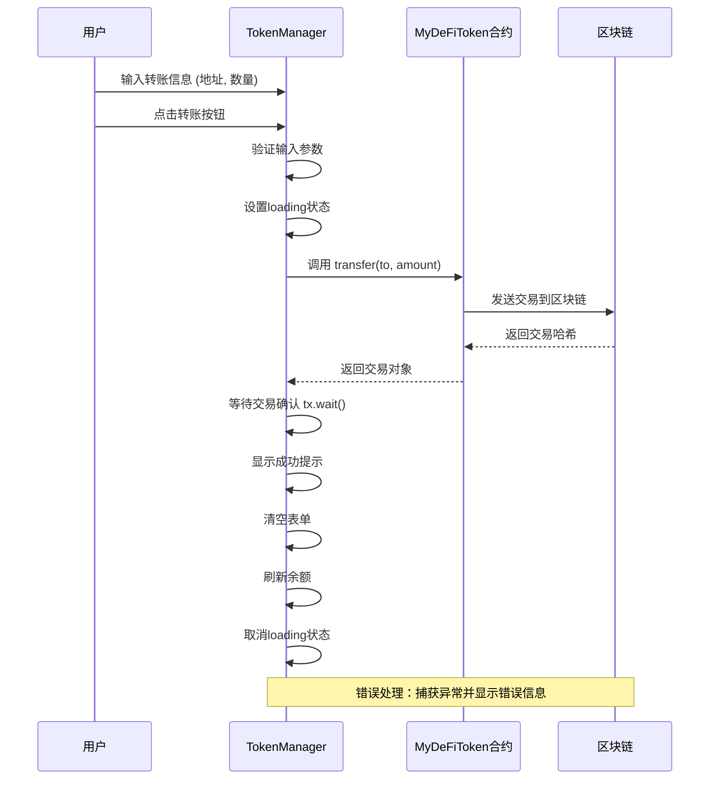

### 3.4 Mint流程

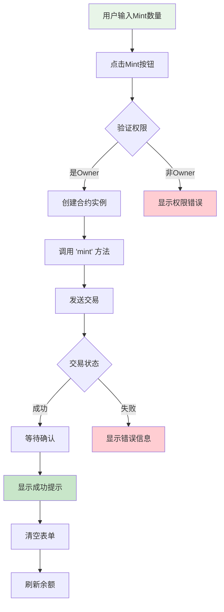

### 3.5 Burn流程

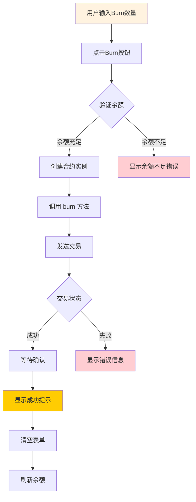

## 4. 核心代码结构

### 4.1 状态管理

```typescript
// TokenManager.tsx 核心状态
const [tokenBalance, setTokenBalance] = useState('0');     // MDT余额
const [usdcBalance, setUsdcBalance] = useState('0');       // USDC余额
const [transferAmount, setTransferAmount] = useState('');   // 转账数量
const [transferTo, setTransferTo] = useState('');          // 转账地址
const [mintAmount, setMintAmount] = useState('');          // Mint数量
const [burnAmount, setBurnAmount] = useState('');          // Burn数量
const [loading, setLoading] = useState(false);             // 加载状态
```

### 4.2 合约交互模式

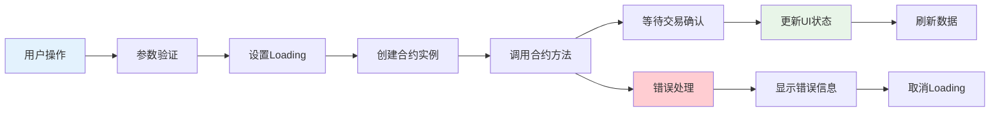

### 4.3 智能合约功能

```solidity
// MyDeFiToken.sol 核心功能
contract MyDeFiToken is ERC20, Ownable {
    // 标准ERC20功能
    function transfer(address to, uint256 amount) returns (bool)
    function balanceOf(address account) view returns (uint256)
    
    // 扩展功能
    function mint(address to, uint256 amount) public onlyOwner  // 仅Owner
    function burn(uint256 amount) public                        // 任何用户
}
```

## 5. 错误处理机制

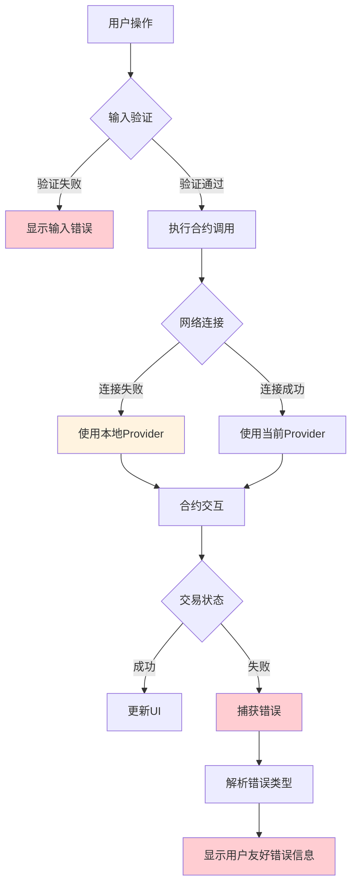

## 6. 用户体验优化

### 6.1 加载状态管理

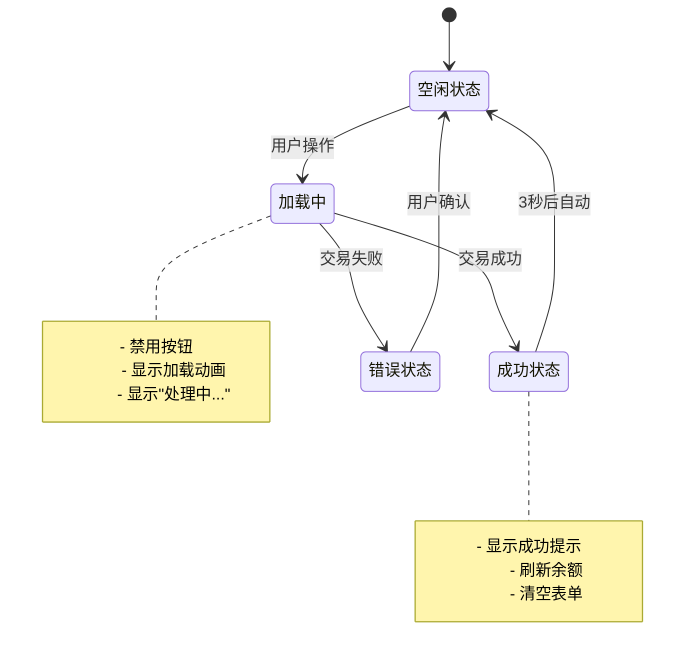

### 6.2 数据格式化

```typescript
// 余额显示格式化
parseFloat(tokenBalance).toFixed(4) + ' MDT'

// 数量输入转换
parseEther(transferAmount)  // 用户输入 -> Wei
formatEther(balance)        // Wei -> 用户显示
```

## 7. 安全考虑

### 7.1 权限控制

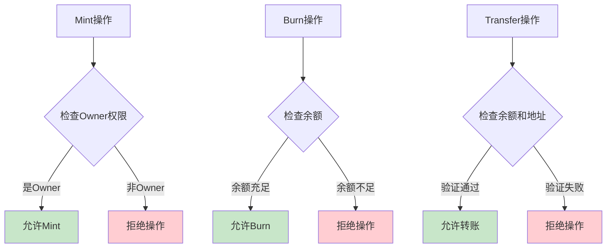

### 7.2 输入验证

```typescript
// 前端验证
if (!signer || !transferAmount || !transferTo) return;

// 地址格式验证
ethers.isAddress(transferTo)

// 数量验证
parseFloat(amount) > 0 && parseFloat(amount) <= parseFloat(balance)
```

## 8. 扩展性设计

### 8.1 模块化架构

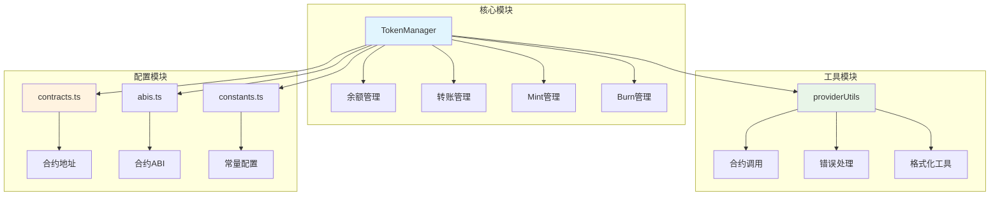

### 8.2 功能扩展点

1. **多代币支持**: 扩展支持更多ERC20代币
2. **批量操作**: 支持批量转账、批量Mint
3. **交易历史**: 记录和显示交易历史
4. **高级功能**: 支持授权(approve)、委托转账等
5. **价格显示**: 集成价格预言机显示代币价值

## 9. 技术特点总结

### 9.1 前端特点
- **React Hooks**: 使用useState、useEffect管理状态
- **TypeScript**: 类型安全的开发体验
- **ethers.js**: 现代化的Web3交互库
- **响应式设计**: 适配不同屏幕尺寸
- **错误边界**: 完善的错误处理机制

### 9.2 合约特点
- **标准兼容**: 完全兼容ERC20标准
- **权限控制**: 使用OpenZeppelin的Ownable
- **安全性**: 内置溢出保护和权限检查
- **可扩展**: 支持Mint和Burn功能
- **事件日志**: 完整的事件记录

### 9.3 架构特点
- **模块化**: 清晰的模块划分
- **可维护**: 代码结构清晰，易于维护
- **可测试**: 支持单元测试和集成测试
- **可扩展**: 易于添加新功能
- **用户友好**: 直观的用户界面和交互体验

