# 借贷功能流程图

## 1. 技术架构图

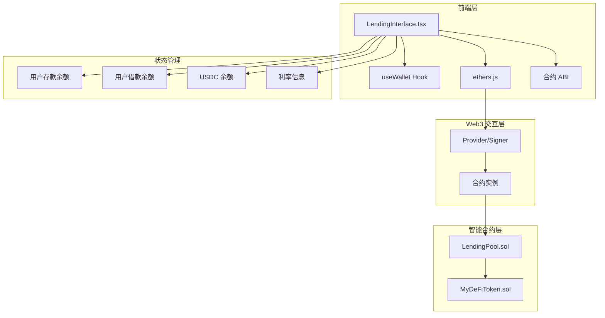

## 2. 核心组件架构

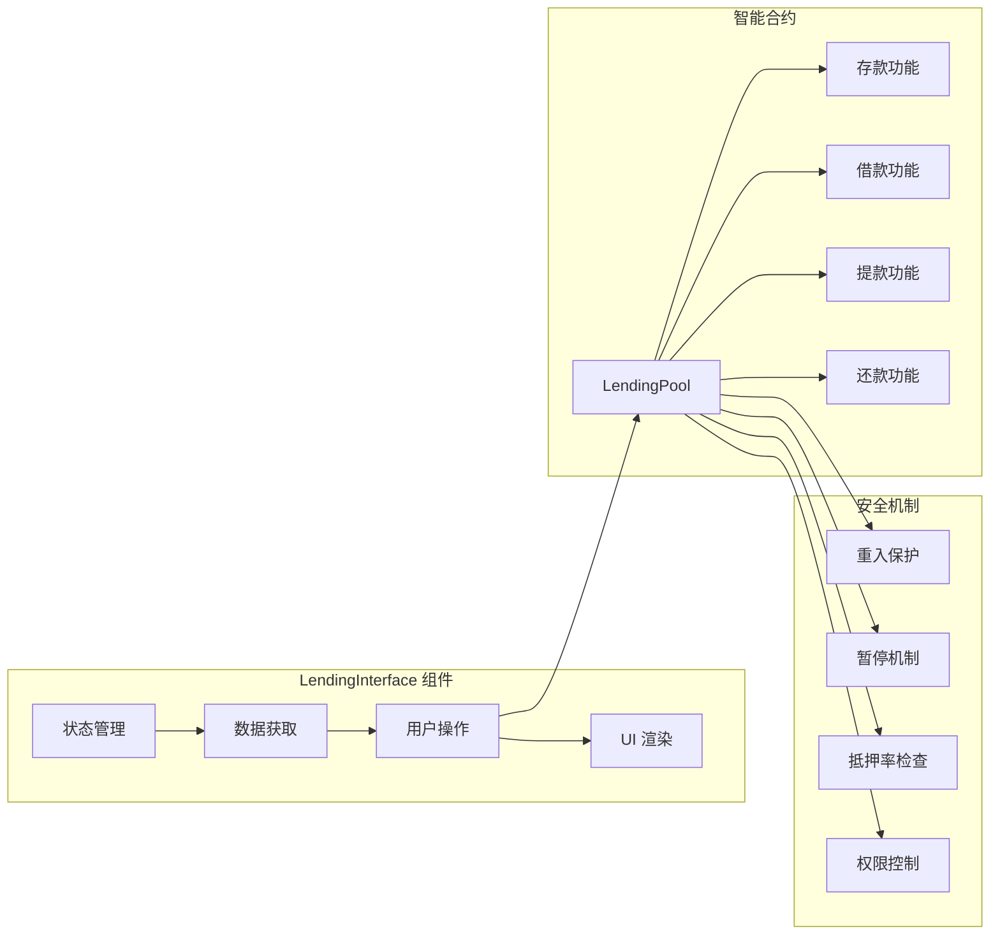

## 3. 借贷功能详细流程

### 3.1 初始化流程

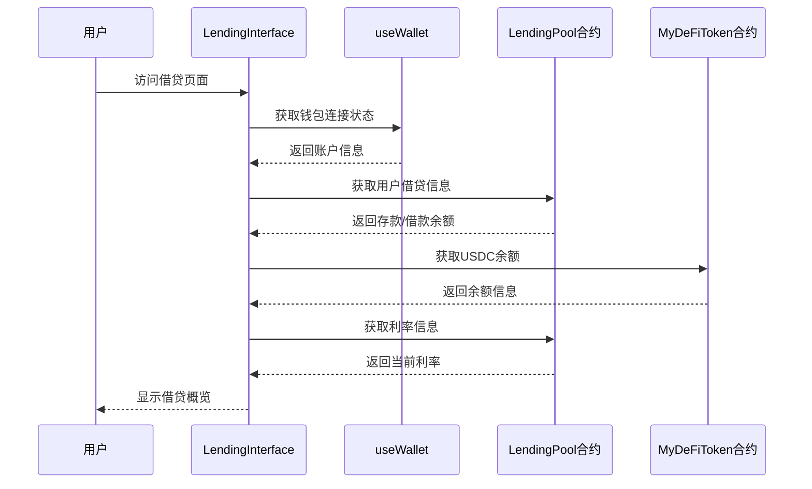

### 3.2 存款流程

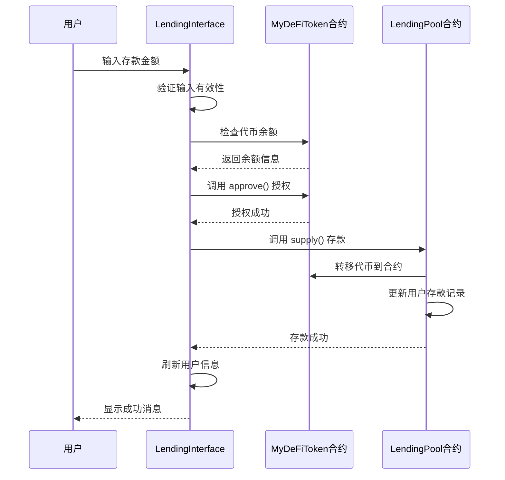

### 3.3 借款流程

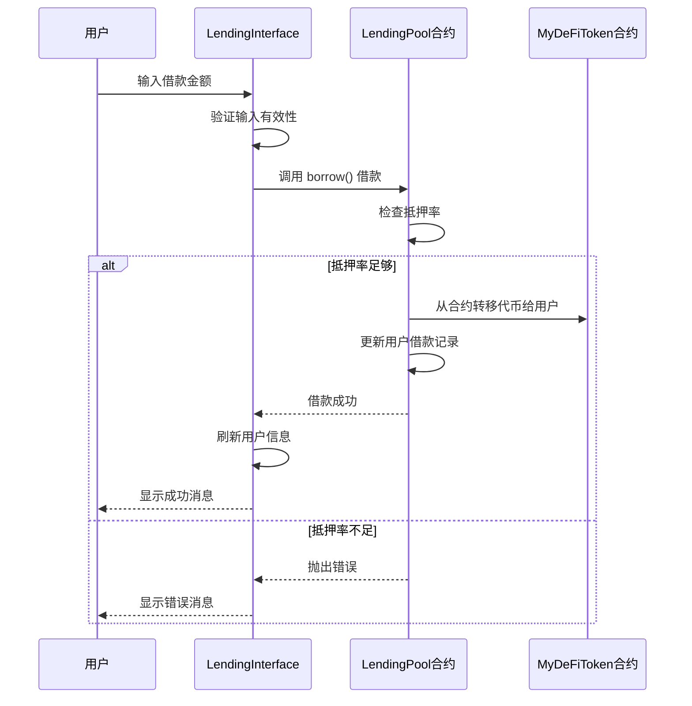

### 3.4 还款流程


### 3.5 提款流程

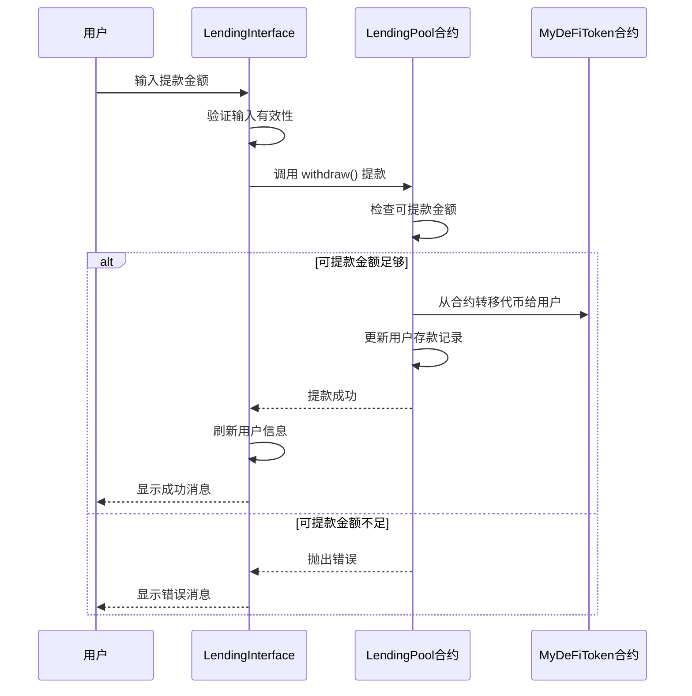

## 4. 核心代码结构

### 4.1 前端组件结构

```typescript
// LendingInterface.tsx 核心结构
interface LendingInterface {
  // 状态管理
  userSupplied: string;
  userBorrowed: string;
  usdcBalance: string;
  interestRate: string;
  
  // 核心功能
  fetchLendingInfo(): Promise<void>;
  handleSupply(amount: string): Promise<void>;
  handleBorrow(amount: string): Promise<void>;
  handleRepay(amount: string): Promise<void>;
  handleWithdraw(amount: string): Promise<void>;
  
  // UI 渲染
  renderOverview(): JSX.Element;
  renderActions(): JSX.Element;
}
```

### 4.2 智能合约结构

```solidity
// LendingPool.sol 核心结构
contract LendingPool {
    // 状态变量
    IERC20 public token;
    uint256 public totalSupplied;
    uint256 public totalBorrowed;
    uint256 public interestRate;
    uint256 public collateralRatio;
    
    // 用户信息
    mapping(address => UserInfo) public userInfo;
    
    // 核心功能
    function supply(uint256 amount) external;
    function withdraw(uint256 amount) external;
    function borrow(uint256 amount) external;
    function repay(uint256 amount) external;
    
    // 辅助功能
    function getAvailableToWithdraw(address user) external view returns (uint256);
    function getUserInfo(address user) external view returns (UserInfo memory);
}
```

## 5. 状态管理机制

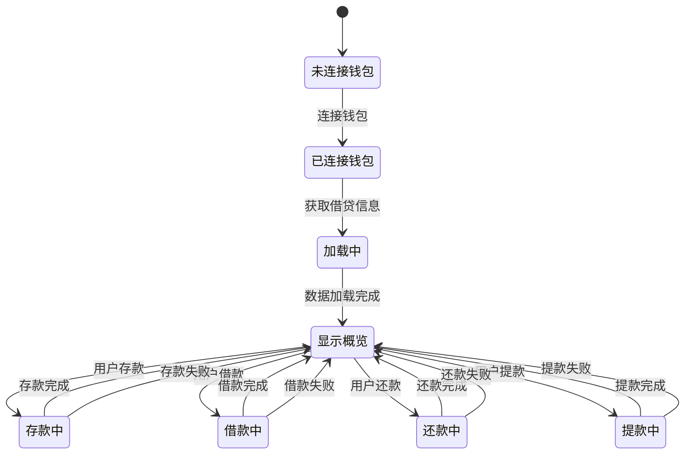

## 6. 错误处理机制

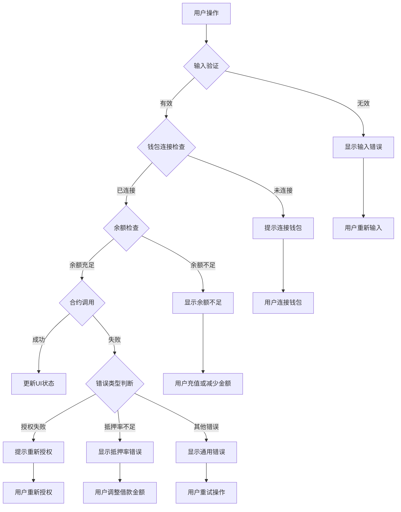

## 7. 安全机制

### 7.1 智能合约安全

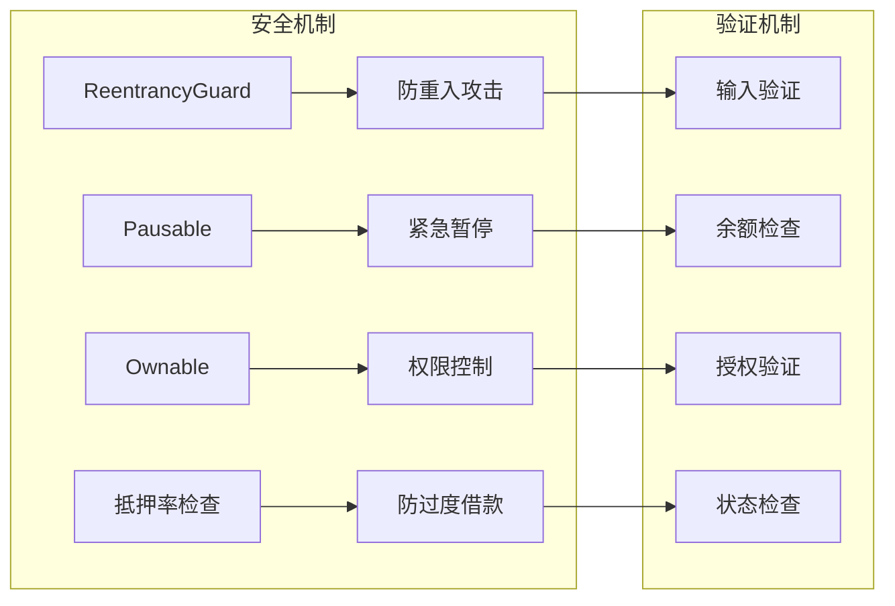

### 7.2 前端安全

```typescript
// 安全检查示例
const safeContractCall = async (contractMethod: () => Promise<any>) => {
  try {
    // 检查钱包连接
    if (!account) throw new Error('钱包未连接');
    
    // 检查网络
    if (!isCorrectNetwork) throw new Error('网络错误');
    
    // 执行合约调用
    const result = await contractMethod();
    return result;
  } catch (error) {
    console.error('合约调用失败:', error);
    throw error;
  }
};
```

## 8. 用户体验优化

### 8.1 加载状态管理

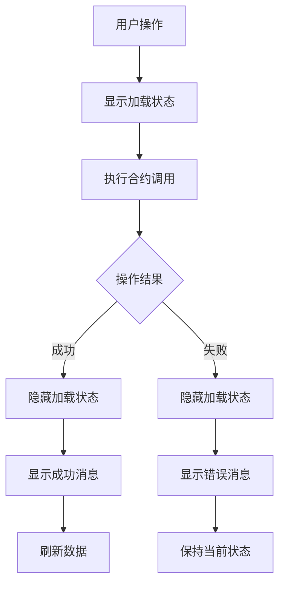

### 8.2 数据格式化

```typescript
// 数据格式化示例
const formatBalance = (balance: string): string => {
  const num = parseFloat(balance);
  if (num === 0) return '0';
  if (num < 0.01) return '< 0.01';
  return num.toFixed(2);
};

const formatPercentage = (rate: string): string => {
  const num = parseFloat(rate);
  return `${(num * 100).toFixed(2)}%`;
};
```

## 9. 扩展性设计

### 9.1 多代币支持

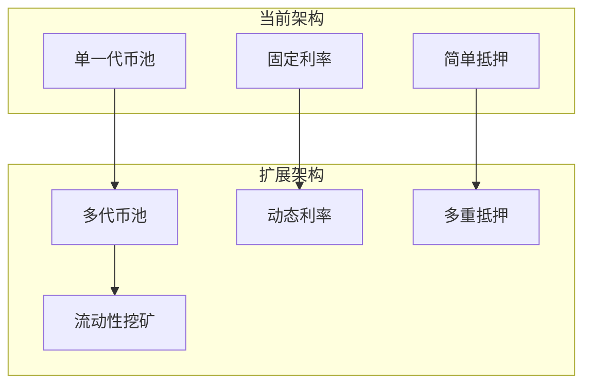

### 9.2 功能扩展点

```typescript
// 扩展接口设计
interface ExtendedLendingPool {
  // 多代币支持
  supportedTokens: string[];
  
  // 动态利率
  calculateInterestRate(utilization: number): number;
  
  // 清算机制
  liquidate(user: string, amount: number): Promise<void>;
  
  // 治理功能
  updateParameters(params: PoolParameters): Promise<void>;
}
```

## 10. 性能优化

### 10.1 数据缓存

```typescript
// 缓存机制
const useDataCache = () => {
  const [cache, setCache] = useState<Map<string, any>>(new Map());
  
  const getCachedData = (key: string, fetcher: () => Promise<any>) => {
    if (cache.has(key)) {
      return cache.get(key);
    }
    
    return fetcher().then(data => {
      setCache(prev => new Map(prev).set(key, data));
      return data;
    });
  };
  
  return { getCachedData };
};
```

### 10.2 批量操作

```typescript
// 批量数据获取
const fetchAllLendingData = async () => {
  const [userInfo, balance, rate] = await Promise.all([
    lendingContract.getUserInfo(account),
    tokenContract.balanceOf(account),
    lendingContract.interestRate()
  ]);
  
  return { userInfo, balance, rate };
};
```

---

## 总结

借贷功能通过以下核心组件实现：

1. **智能合约层**：LendingPool.sol 提供核心借贷逻辑
2. **前端组件**：LendingInterface.tsx 提供用户交互界面
3. **Web3集成**：通过 ethers.js 与区块链交互
4. **安全机制**：多重安全保护和验证
5. **用户体验**：响应式设计和状态管理

该系统支持存款、借款、还款、提款等完整的借贷功能，具有良好的安全性和扩展性。