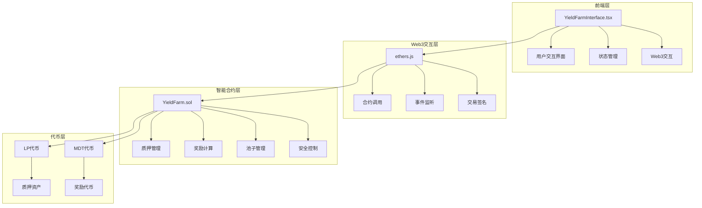
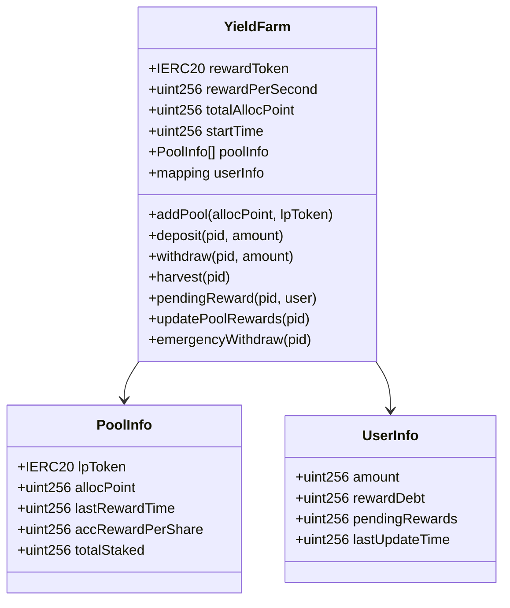
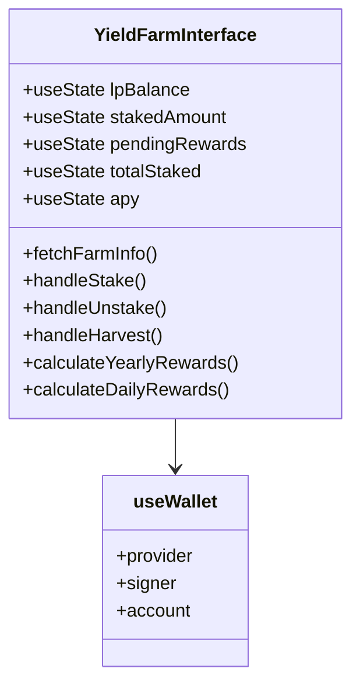
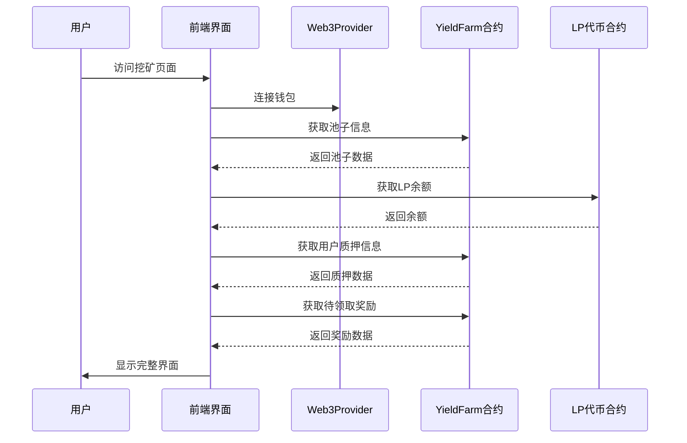
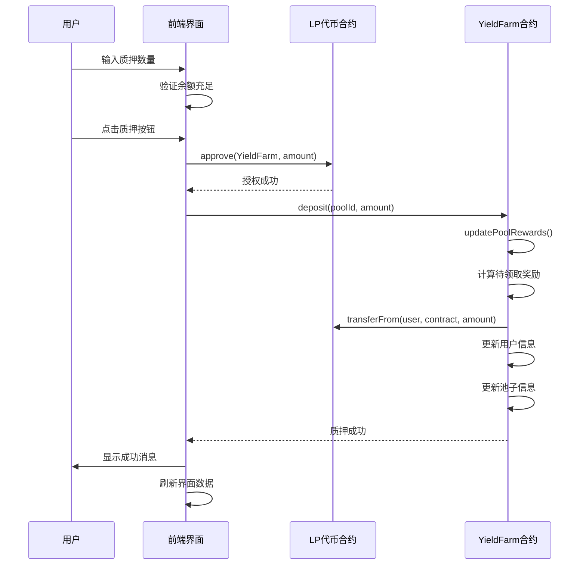
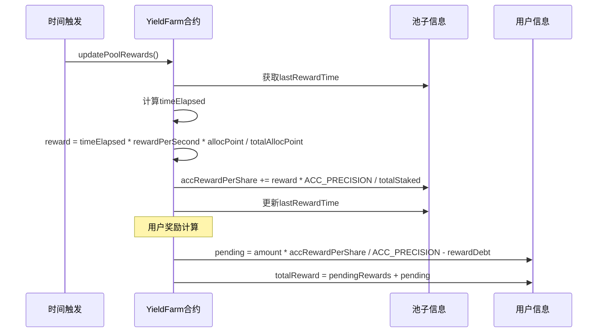
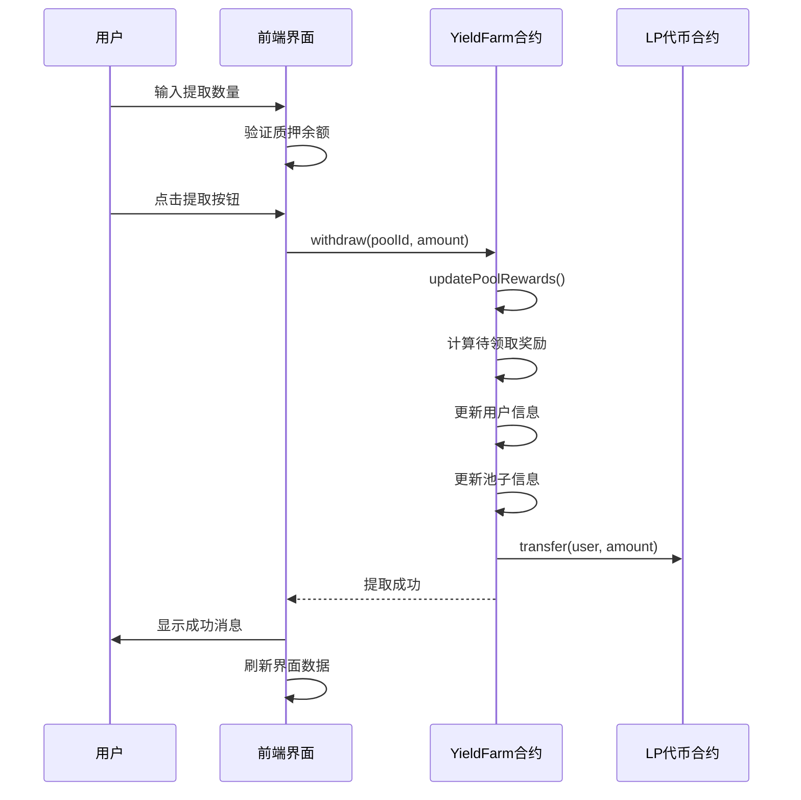
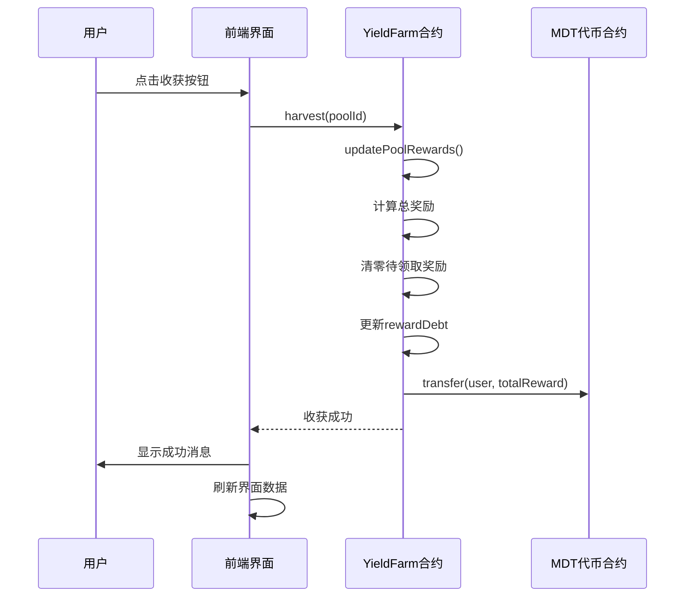
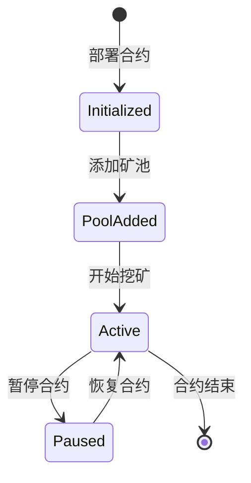
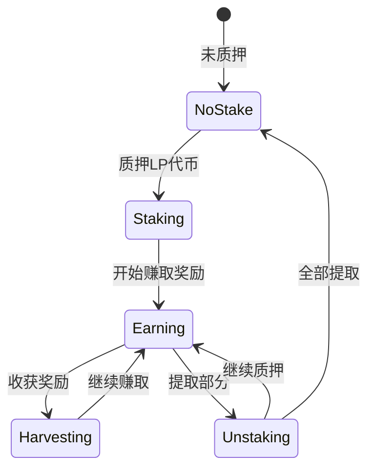

# 挖矿功能流程图

## 技术架构图



## 核心组件架构

### 1. 智能合约层 - YieldFarm.sol



### 2. 前端组件 - YieldFarmInterface.tsx



## 挖矿功能详细流程

### 1. 初始化流程



### 2. 质押流程



### 3. 奖励计算流程



### 4. 提取流程



### 5. 收获奖励流程



## 核心算法说明

### 1. 奖励计算算法

**基本公式**：
```
每池奖励 = 时间间隔 × 每秒奖励 × 池子分配点数 ÷ 总分配点数
累积每股奖励 += 每池奖励 × 精度常量 ÷ 池子总质押量
用户待领取奖励 = 用户质押量 × 累积每股奖励 ÷ 精度常量 - 奖励债务
```

**实现代码**：
```solidity
// 更新池子奖励
uint256 timeElapsed = block.timestamp - pool.lastRewardTime;
uint256 reward = (timeElapsed * rewardPerSecond * pool.allocPoint) / totalAllocPoint;
pool.accRewardPerShare += (reward * ACC_PRECISION) / pool.totalStaked;

// 计算用户奖励
uint256 pending = (user.amount * pool.accRewardPerShare) / ACC_PRECISION - user.rewardDebt;
```

### 2. APY计算算法

**前端APY计算**：
```typescript
const yearlyRewards = parseFloat(formatEther(rewardPerSecond)) * SECONDS_PER_YEAR;
const totalStakedValue = parseFloat(formatEther(totalStaked));
const apy = (yearlyRewards / totalStakedValue) * 100;
```

### 3. 奖励债务机制

**目的**：防止用户通过频繁质押/提取来获取不当奖励

**机制**：
- 质押时：`rewardDebt = amount * accRewardPerShare / ACC_PRECISION`
- 提取时：先计算奖励，再更新债务
- 收获时：清零pendingRewards，更新rewardDebt

## 核心代码结构

### 1. 智能合约核心函数

```solidity
// 质押函数
function deposit(uint256 _pid, uint256 _amount) external nonReentrant whenNotPaused {
    updatePoolRewards(_pid);
    // 计算待领取奖励
    if (user.amount > 0) {
        uint256 pending = (user.amount * pool.accRewardPerShare) / ACC_PRECISION - user.rewardDebt;
        user.pendingRewards += pending;
    }
    // 转移代币并更新状态
    pool.lpToken.safeTransferFrom(msg.sender, address(this), _amount);
    user.amount += _amount;
    user.rewardDebt = (user.amount * pool.accRewardPerShare) / ACC_PRECISION;
    pool.totalStaked += _amount;
}

// 奖励计算函数
function updatePoolRewards(uint256 _pid) public {
    if (pool.totalStaked == 0) return;
    
    uint256 timeElapsed = block.timestamp - pool.lastRewardTime;
    uint256 reward = (timeElapsed * rewardPerSecond * pool.allocPoint) / totalAllocPoint;
    pool.accRewardPerShare += (reward * ACC_PRECISION) / pool.totalStaked;
    pool.lastRewardTime = block.timestamp;
}
```

### 2. 前端核心逻辑

```typescript
// 获取农场信息
const fetchFarmInfo = async () => {
    const [lpBal, userInfoData, pendingRewardsData, poolInfoData] = await Promise.all([
        lpContract.balanceOf(account),
        farmContract.userInfo(poolId, account),
        farmContract.pendingReward(poolId, account),
        farmContract.poolInfo(poolId)
    ]);
    
    // 计算APY
    const rewardPerSecond = await farmContract.rewardPerSecond();
    const yearlyRewards = parseFloat(formatEther(rewardPerSecond)) * SECONDS_PER_YEAR;
    const apy = (yearlyRewards / totalStakedValue) * 100;
};

// 质押处理
const handleStake = async () => {
    // 授权LP代币
    const approveTx = await lpContract.approve(CONTRACTS.YieldFarm, amount);
    await approveTx.wait();
    
    // 执行质押
    const tx = await farmContract.deposit(poolId, amount);
    await tx.wait();
};
```

## 状态管理机制

### 1. 合约状态



### 2. 用户状态



## 安全机制

### 1. 智能合约安全

- **重入攻击防护**：使用`ReentrancyGuard`
- **权限控制**：`Ownable`限制管理员功能
- **暂停机制**：`Pausable`紧急暂停功能
- **安全转账**：使用`SafeERC20`
- **输入验证**：检查池ID、数量等参数
- **溢出保护**：Solidity 0.8+内置溢出检查

### 2. 前端安全

```typescript
// 输入验证
if (!signer || !stakeAmount) return;
require(user.amount >= _amount, "Insufficient staked amount");

// 安全的合约调用
const result = await safeContractCall(
    () => farmContract.userInfo(poolId, account),
    [BigInt(0), BigInt(0), BigInt(0), BigInt(0)]
);

// 异常值处理
if (calculatedApy > MAX_APY || !isFinite(calculatedApy)) {
    calculatedApy = parseFloat(UI_CONFIG.DEFAULT_APY);
}
```

### 3. 经济安全

- **奖励债务机制**：防止不当获利
- **时间锁定**：防止闪电贷攻击
- **分配点数控制**：合理分配奖励
- **紧急提取**：放弃奖励的安全退出

## 用户体验优化

### 1. 界面优化

- **实时数据更新**：自动刷新余额和奖励
- **加载状态显示**：操作过程中的loading状态
- **错误处理**：友好的错误提示信息
- **响应式设计**：适配不同设备屏幕

### 2. 交互优化

```typescript
// 一键最大质押
onClick={() => setStakeAmount(lpBalance)}

// 实时收益计算
const calculateDailyRewards = () => {
    const dailyRate = apyRate / 365;
    return (staked * dailyRate) / 100;
};

// 预期收益展示
<div className="earnings-grid">
    <div>日收益: {calculateDailyRewards()} MDT</div>
    <div>月收益: {calculateDailyRewards() * 30} MDT</div>
    <div>年收益: {calculateYearlyRewards()} MDT</div>
</div>
```

### 3. 数据展示

- **格式化数字**：统一的小数位数显示
- **百分比显示**：APY等比率的直观展示
- **实时更新**：pending rewards的实时计算
- **历史记录**：质押和收获的历史记录

## 扩展性设计

### 1. 多池支持

```solidity
// 支持多个矿池
function addPool(uint256 _allocPoint, IERC20 _lpToken) external onlyOwner {
    poolInfo.push(PoolInfo({
        lpToken: _lpToken,
        allocPoint: _allocPoint,
        lastRewardTime: block.timestamp,
        accRewardPerShare: 0,
        totalStaked: 0
    }));
}
```

### 2. 动态奖励调整

```solidity
// 动态调整奖励速率
function updateRewardPerSecond(uint256 _rewardPerSecond) external onlyOwner {
    massUpdatePools();
    rewardPerSecond = _rewardPerSecond;
}
```

### 3. 治理集成

- **提案投票**：使用质押代币进行治理投票
- **参数调整**：通过治理调整奖励参数
- **升级机制**：支持合约升级和迁移

## 性能优化

### 1. Gas优化

- **批量更新**：`massUpdatePools()`批量处理
- **懒惰计算**：按需更新池子奖励
- **精度优化**：使用合适的精度常量
- **存储优化**：合理的数据结构设计

### 2. 前端优化

```typescript
// 防抖处理
const debouncedFetchInfo = useCallback(
    debounce(fetchFarmInfo, 1000),
    [provider, account]
);

// 缓存机制
const memoizedCalculations = useMemo(() => ({
    dailyRewards: calculateDailyRewards(),
    yearlyRewards: calculateYearlyRewards()
}), [stakedAmount, apy]);
```

### 3. 网络优化

- **并行请求**：使用`Promise.all`并行获取数据
- **错误重试**：网络失败时的自动重试
- **离线支持**：缓存关键数据支持离线查看

## 监控和分析

### 1. 事件监听

```solidity
event Deposit(address indexed user, uint256 indexed pid, uint256 amount);
event Withdraw(address indexed user, uint256 indexed pid, uint256 amount);
event Harvest(address indexed user, uint256 indexed pid, uint256 amount);
```

### 2. 数据分析

- **TVL追踪**：总锁定价值监控
- **APY变化**：收益率变化趋势
- **用户行为**：质押和提取模式分析
- **奖励分发**：奖励代币分发统计

这个挖矿功能实现了完整的流动性挖矿机制，通过质押LP代币获得MDT奖励，具有安全、高效、用户友好的特点。