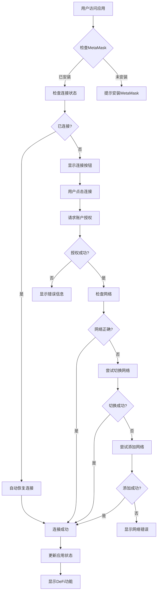
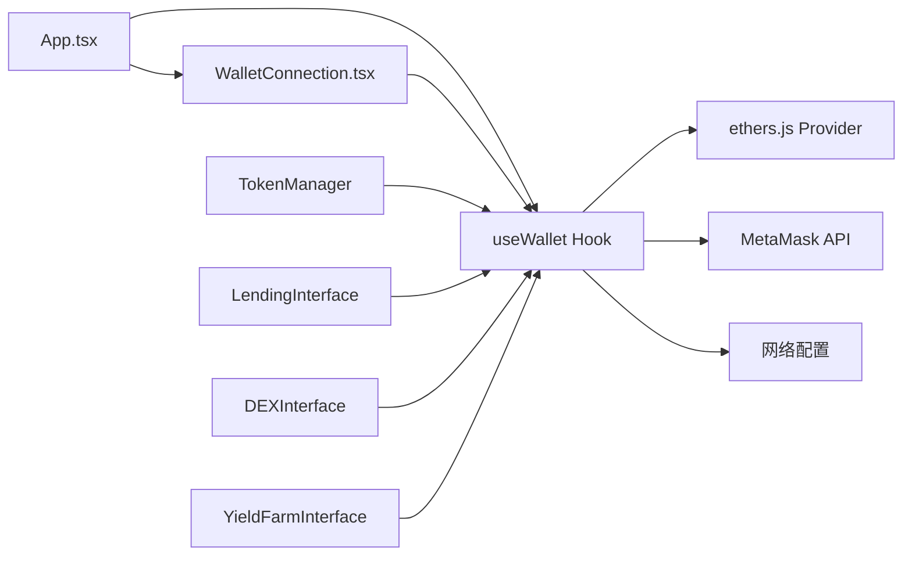
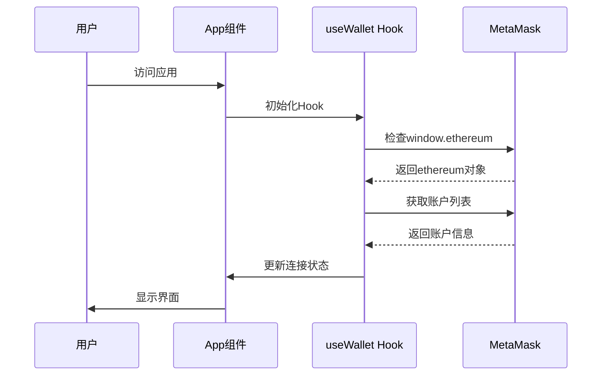
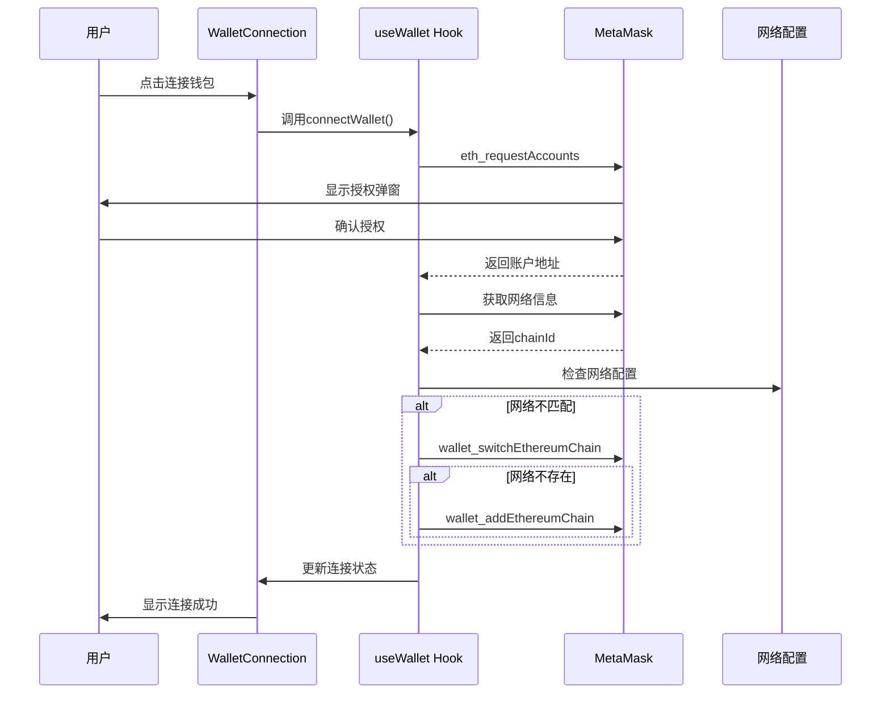
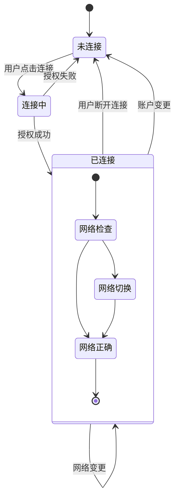
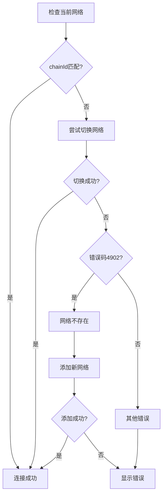
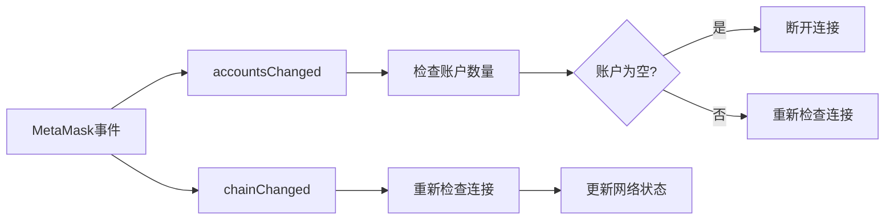

# 钱包连接流程图

## 概述

本文档详细描述了Web3 DeFi Protocol项目中钱包连接的完整流程，包括技术架构、核心组件和用户交互流程。

## 技术架构图



## 核心组件架构



## 详细流程说明

### 1. 初始化阶段



### 2. 连接流程



### 3. 状态管理流程



## 核心代码结构

### 1. useWallet Hook 结构

```typescript
// 状态接口
interface WalletState {
  account: string | null;           // 用户账户
  provider: BrowserProvider | null; // ethers Provider
  signer: ethers.Signer | null;    // 签名器
  isConnected: boolean;            // 连接状态
  isConnecting: boolean;           // 连接中状态
  chainId: number | null;          // 网络ID
}

// 核心功能
const useWallet = () => {
  // 状态管理
  const [walletState, setWalletState] = useState<WalletState>()
  
  // 核心方法
  const checkConnection = useCallback()     // 检查连接
  const connectWallet = useCallback()       // 连接钱包
  const disconnectWallet = useCallback()    // 断开连接
  
  // 事件监听
  useEffect(() => {
    window.ethereum.on('accountsChanged')  // 账户变更
    window.ethereum.on('chainChanged')     // 网络变更
  })
}
```

### 2. 组件层次结构

```
App.tsx
├── WalletConnection.tsx (钱包连接UI)
├── TokenManager.tsx (代币管理)
├── LendingInterface.tsx (借贷界面)
├── DEXInterface.tsx (DEX交易)
└── YieldFarmInterface.tsx (流动性挖矿)

Hooks:
└── useWallet.ts (钱包状态管理)

Config:
├── contracts.ts (合约配置)
└── constants.ts (常量配置)
```

## 网络配置流程



## 错误处理机制

### 常见错误类型

1. **MetaMask未安装**
   - 检测：`typeof window.ethereum === 'undefined'`
   - 处理：提示用户安装MetaMask

2. **用户拒绝授权**
   - 检测：`accounts.length === 0`
   - 处理：显示授权失败信息

3. **网络不匹配**
   - 检测：`network.chainId !== NETWORK_CONFIG.chainId`
   - 处理：自动切换或添加网络

4. **网络切换失败**
   - 检测：`switchError.code === 4902`
   - 处理：尝试添加网络配置

## 事件监听机制



## 用户体验优化

### 1. 加载状态管理
- `isConnecting`: 显示连接中状态
- 禁用按钮防止重复点击
- 提供视觉反馈

### 2. 地址格式化
```typescript
const formatAddress = (address: string) => {
  return `${address.slice(0, 6)}...${address.slice(-4)}`;
}
```

### 3. 网络显示
- 显示当前网络名称
- 网络状态指示器
- 自动网络切换

## 安全考虑

1. **类型安全**：完整的TypeScript类型定义
2. **错误边界**：完善的错误捕获和处理
3. **状态验证**：连接状态的多重验证
4. **事件清理**：组件卸载时清理事件监听器

## 扩展性设计

### 支持多钱包
```typescript
// 未来可扩展支持
const SUPPORTED_WALLETS = {
  METAMASK: 'MetaMask',
  COINBASE: 'Coinbase Wallet',
  WALLETCONNECT: 'WalletConnect'
}
```

### 多网络支持
```typescript
const NETWORKS = {
  MAINNET: { chainId: 1, name: 'Ethereum Mainnet' },
  SEPOLIA: { chainId: 11155111, name: 'Sepolia Testnet' },
  LOCALHOST: { chainId: 31337, name: 'Hardhat Local' }
}
```

## 总结

钱包连接系统是整个DeFi应用的基础设施，通过：

- **模块化设计**：Hook + 组件分离
- **状态管理**：集中式钱包状态
- **错误处理**：完善的异常捕获
- **用户体验**：流畅的交互流程
- **网络适配**：自动网络检测和切换

为用户提供了稳定、安全、易用的Web3连接体验。